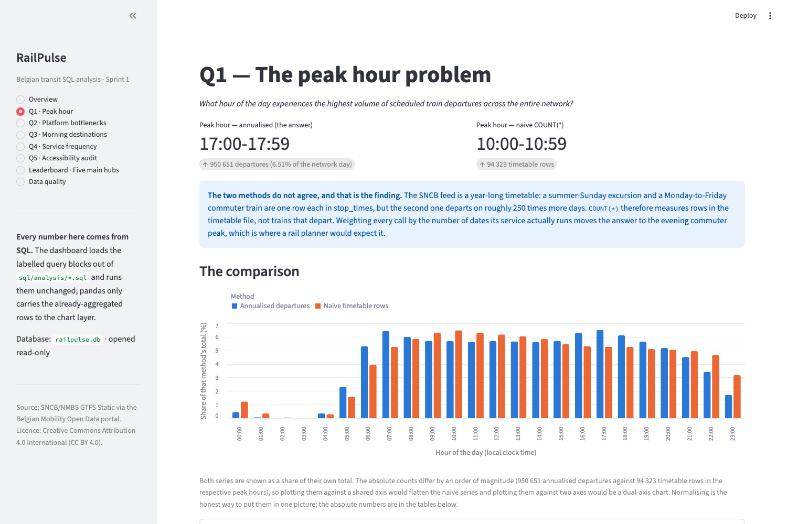
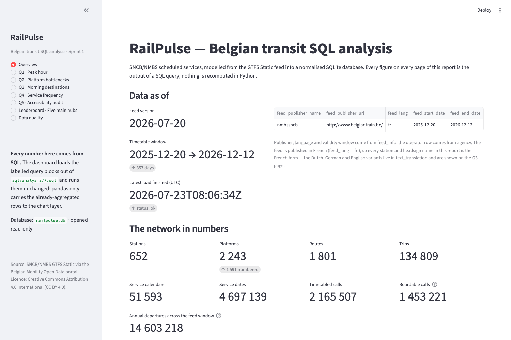
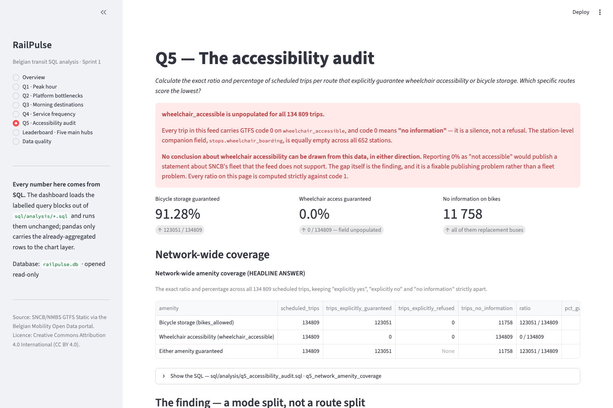
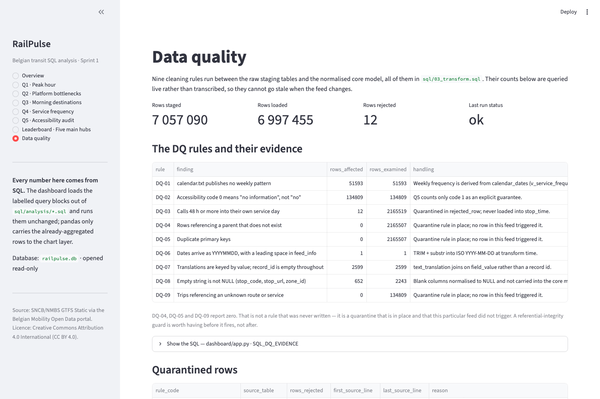
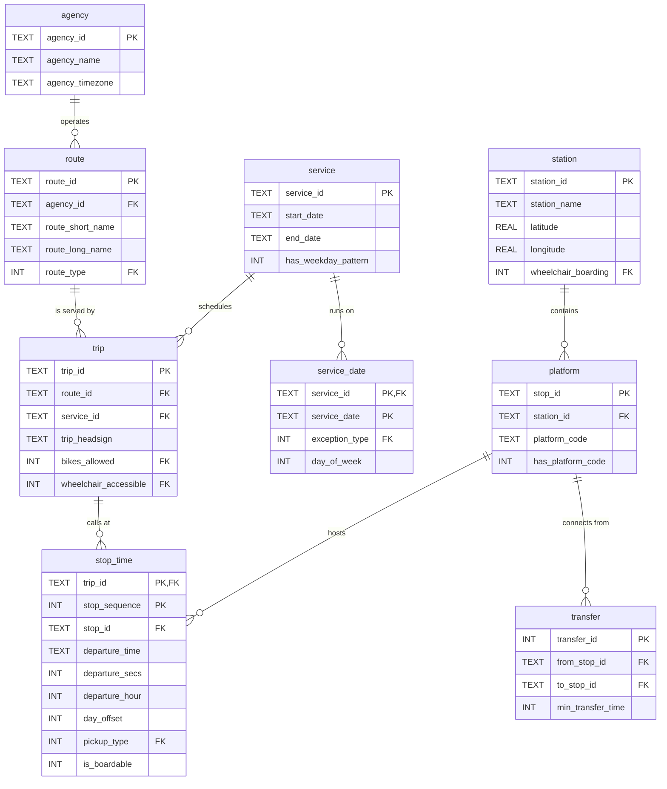
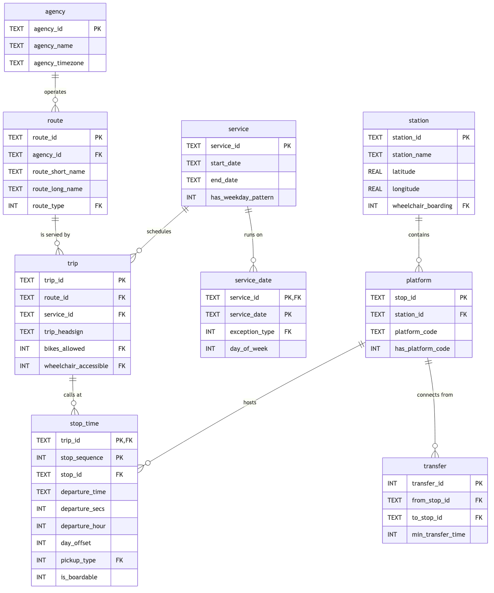

# 🚉 RailPulse — Belgian Transit SQL Analysis

> *We are RailPulse, an urban mobility consulting firm. The Belgian National
> Railway company (SNCB/NMBS) wants a clear overview of operational performance
> and delay patterns to optimise their winter scheduling.*

A production-shaped SQL analytics pipeline over the Belgian national rail
network. It ingests the official SNCB/NMBS GTFS feed from the Belgian Mobility
open-data portal, normalises **2.17 million scheduled departures** into a 3NF
SQLite model, and answers five operational questions with SQL alone.

**Sprint 1 of 4** — local ingestion and relational modelling. Sprints 2–4 (Azure
migration, Power BI, GenAI text-to-SQL) are out of scope for this repository.

|                             |                                                                                                                    |
| --------------------------- | ------------------------------------------------------------------------------------------------------------------ |
| **Data source**       | [Belgian Mobility Open Data](https://data.belgianmobility.io/en/data.html) — NMBS/SNCB GTFS Static + GTFS-Realtime |
| **Timetable covered** | 2025-12-20 → 2026-12-12 (feed version`2026-07-20`)                                                              |
| **Scale**             | 2,165,507 calls · 134,809 trips · 4,697,139 service days · 1,801 routes · 652 stations                         |
| **Engine**            | SQLite 3.45 · strict foreign keys · WAL                                                                          |
| **Build time**        | ~2–3 min from zip to indexed, verified database (offline rebuild ~160 s)                                            |
| **Licence (data)**    | CC BY 4.0 —*NMBS-SNCB – Open Data – 2026-07-20*                                                               |

> 🆕 **New to transit data or to database jargon?**
> Start with **[`docs/glossary.md`](docs/glossary.md)**. It defines every term
> this project uses — GTFS, trip, headsign, service calendar, stop_time, 3NF,
> SARGable, fact table, window function, and the project's own vocabulary like
> *annualised departures* and *boardable call* — with examples from this data.
> It is written to be read top to bottom as a primer, not just looked up.

---

## 🧭 What is this, in plain terms?

Belgium's national railway publishes its entire timetable as open data, in a
worldwide standard format called **GTFS** — which in practice is a ZIP file
containing ten CSV files. It is a *plan*: 2.17 million scheduled stops across a
year, with no types, no constraints and no guarantees that anything references
anything else.

This project turns that ZIP into a real relational database — one where a train
cannot reference a station that does not exist, where every cleaning decision is
written down, and where five operational questions can be answered in SQL and
defended.

The interesting part is not the SQL. It is that **the two most obvious queries
give confidently wrong answers**, for reasons that are properties of the data
rather than mistakes in the code. Finding that out, and reporting it honestly,
is most of the work. See [The answers](#-the-answers) below.

---

## 📌 The answers

| #           | Question                               | Answer                                                                                                                                                                                              |
| ----------- | -------------------------------------- | --------------------------------------------------------------------------------------------------------------------------------------------------------------------------------------------------- |
| **1** | Busiest hour on the network            | **17:00–17:59** — 950,651 annual departures (6.51%). 07:00 second at 938,525.                                                                                                               |
| **2** | Busiest platforms at Bruxelles-Central | **Platforms 4, 3 and 2** — 63,426 / 62,276 / 56,874 annual departures.                                                                                                                       |
| **3** | Busiest morning destinations           | **Anvers-Central** (41,972), **Louvain** (27,516), **Charleroi-Central** (21,328).                                                                                                |
| **4** | Service frequency mix                  | **45.24%** High · **34.65%** Medium · **20.11%** Low/Special — the 45% carries **86.21%** of all operating days.                                                         |
| **5** | Amenity availability                   | **91.28%** of trips guarantee bike storage: **100%** of rail, **0%** of the 270 replacement-bus routes. `wheelchair_accessible` is **unpopulated for all 134,809 trips**. |

**📊 The full narrative report is [`docs/analysis_report.md`](docs/analysis_report.md)** —
with the reasoning, the caveats, and what we would send back to the publisher.

### Three findings worth the click

**The timetable file hides the evening peak.** Counting rows says the network
peaks at 10:00. Counting departures that actually happen says 17:00 — because a
midday call runs on an average of 8.8 days a year while a 17:00 call runs on
12.4. Hour 17 moves from **rank 10 to rank 1** once each call is weighted by how
often its service operates. Capacity planning from an unweighted count would
target the wrong hour.

**Bruxelles-Central is the network's structural bottleneck.** It handles more
annual departures than Bruxelles-Midi (311,324 vs 283,415) across **6 platforms
instead of 21** — 8,113 timetabled calls per platform against Midi's 2,085, a
**3.9× pressure differential**, with no trough in the day to absorb a disruption.

**The accessibility gap is a publishing gap.** `wheelchair_accessible` is empty
for every trip and `wheelchair_boarding` for every station. Reporting "0%
accessible" would be wrong — GTFS code `0` means *no information* — but it does
mean no journey planner or regulator using this feed can answer a wheelchair
question about SNCB at all.

---

## 📺 The report

`make dashboard` serves an interactive Streamlit report. Every figure on every
page is the output of a labelled query block loaded straight out of
`sql/analysis/*.sql` — the dashboard does not contain a second copy of the
analysis, and pandas only carries already-aggregated rows to the chart layer.

### Q1 — the finding, made visible



The blue series (annualised departures) has the twin commuter peaks of a real
railway. The orange series (naive row counts) is a midday plateau. Same data,
same database, two different questions — and only one of them is the one the
client asked.

<details><summary>More pages</summary>

**Overview** — provenance, network scale, what each page answers


**Q5 · Accessibility audit** — the mode split, and the unpopulated field


**Data quality** — the nine rules and what each caught, counted live


</details>

### 🤖 SQL Chat — ask the timetable in plain English (Sprint-4 preview)

The dashboard also carries a **text-to-SQL** page: you type a question ("*top 10
busiest stations by annual departures*"), a locally-running HuggingFace model
translates it to SQL, and the SQL — shown transparently in an expander — is run
against the read-only database and charted. It is a small preview of Sprint 4's
GenAI capstone, built fully local (no API key, no cloud inference).

It is **optional and isolated**: the model stack (torch + transformers, ~2 GB)
is not part of the normal dashboard install, and the page shows an install
prompt if it is absent.

```bash
make setup-chat          # installs the ML stack (or: pip install -e ".[chat]")
make dashboard           # then pick "SQL Chat · Ask the timetable" in the sidebar
```

**Safety is defence in depth, not trust in the model** ([ADR-14](docs/decisions.md#adr-14--sql-chat-text-to-sql-is-guarded-by-defence-in-depth-not-by-the-model)):

1. the query runs on a **read-only** connection — a write raises at the engine;
2. a **whole-statement guardrail** rejects stacked statements, comment-hidden
   verbs and any destructive keyword (not just a first-word check);
3. **execution caps** — a wall-clock timeout and a row limit — stop a valid but
   ruinous query (a cartesian join, an unbounded `SELECT *`) from hanging the
   dashboard.

All three are covered by `tests/test_sql_chat.py`. Honest limitation: the
default 0.2 B model handles simple lookups well and struggles with the
multi-table JOINs the analytical questions need — point `TEXT2SQL_MODEL` at a
larger model and set `TEXT2SQL_SCHEMA_MODE=rich` (which injects the full schema +
rules) for stronger results. See [`dashboard/README.md`](dashboard/README.md).

---

## 🗺️ Entity Relationship Diagram

The core model. The full diagram — reference tables, real-time tables and every
column — is in [`docs/erd.md`](docs/erd.md), with a
[drawDB-importable JSON](docs/railpulse.drawdb.json) alongside it.

**Reading the notation** (crow's foot). The symbol touching each table is the
count of rows that can participate: `||` = exactly one, `o{` = zero or many,
`|{` = one or many. So `station ||--o{ platform` reads "one station has zero or
many platforms, and every platform belongs to exactly one station".



<details><summary>Static image (if mermaid does not render for you)</summary>



</details>

### Two modelling decisions worth explaining

**`station` and `platform` are separate tables.** GTFS ships both in one
`stops.txt` with a `location_type` discriminator — two grains in one file, which
is exactly what normalisation forbids. Splitting them gives a real one-to-many
key, stores `station_name` exactly once (verified: 0 of 2,243 child stops
disagree with their parent, so keeping it on the child would be a pure
transitive dependency), and gives the platform-bottleneck question somewhere to
live.

**`stop_time` carries derived columns, deliberately.** `departure_secs`,
`departure_hour`, `day_offset` and `is_boardable` are computed once at load
time. This is a documented denormalisation traded for SARGability: computing
`departure_hour` per query instead makes the Q1 histogram **~100× slower** and
the platform lookup **~500× slower** (measured — see
[`q7_index_optimisation.sql`](sql/analysis/q7_index_optimisation.sql)).

---

## 🏗️ Architecture

The challenge forbids pandas for filtering or aggregating. Rather than work
around that, the project leans into it: **Python does network I/O and executes
SQL; every rule lives in a `.sql` file.**

```
  Belgian Mobility API                    Python                      SQL
  ────────────────────                    ──────                      ───
  GTFS Static (26 MB zip)  ──requests──▶  ingest_static ──verbatim──▶ stg_*
                                              │                         │
                                              │                    03_transform
                                              │                    (9 DQ rules)
                                              │                         ▼
                                              │                   normalised core
                                              │                    (3NF, FK-enforced)
                                              │                         │
                                              │                    04_indexes
                                              │                    05_views
                                              │                         ▼
  GTFS-RT JSON (every 30s) ──requests──▶  ingest_realtime ────────▶  rt_*
                                                                        │
                                                            sql/analysis/q*.sql
                                                                        ▼
                                                        output/*.csv + report + dashboard
```

Python never inspects a value. A cell reading `"87:39:00"` lands in staging as
the string `"87:39:00"`; whether that is a plausible departure is a question for
[`03_transform.sql`](sql/03_transform.sql), which quarantines it into
`rejected_row` **with a reason** — something a Python `if` could only do by
throwing the information away.

---

## 📁 Repository structure

```
railpulse_sql_analysis/
├── Makefile                      one-command entry points — `make help`
├── requirements.txt              the pipeline: requests + python-dotenv only
├── requirements-dashboard.txt    optional extras: streamlit, pandas, altair, playwright
├── .env.example                  template for BMC_API_KEY (real .env is git-ignored)
│
├── sql/                          ← every rule and every metric lives here
├── src/railpulse/                ← the thin Python layer that runs the SQL
├── scripts/                      ← operational scripts (cron poller, API-key setup)
├── tests/                        ← 149 tests over a synthetic broken feed
├── dashboard/                    ← Streamlit report + optional SQL Chat (text-to-SQL)
├── docs/                         ← ERD, data dictionary, reports, ADRs
├── output/                       ← generated: one CSV per analysis query
└── data/                         ← generated: raw feed + the SQLite database (git-ignored)
```

### `src/railpulse/` — the Python package

Python has exactly two jobs in this project: **network I/O** and **executing
SQL**. Nothing here inspects, filters or aggregates a data value — that is all
in `sql/`. Run any of it with `python -m railpulse <command>`.

| File                             | Lines | What it does                                                                                                                                                                                                                                                                                                                                                                                                                                                                                                                                                                                   |
| -------------------------------- | ----: | ---------------------------------------------------------------------------------------------------------------------------------------------------------------------------------------------------------------------------------------------------------------------------------------------------------------------------------------------------------------------------------------------------------------------------------------------------------------------------------------------------------------------------------------------------------------------------------------------- |
| **`cli.py`**             |   178 | The single entry point.`python -m railpulse <build\|analyse\|verify\|poll\|fetch\|benchmark\|info\|all>`; each subcommand delegates to its module and forwards its own arguments, so `railpulse build --help` shows build options.                                                                                                                                                                                                                                                                                                                                                                |
| **`config.py`**          |   145 | The only module that reads`os.environ`. Paths, API endpoints, the operator to ingest, rate-limit constants, batch size, the GTFS-file→staging-table map, the licence/attribution strings, and the five hub names so the dashboard and the SQL cannot disagree about the shortlist.                                                                                                                                                                                                                                                                                                          |
| **`db.py`**              |   224 | The only module that touches the engine. Applies the PRAGMAs every connection needs — critically`foreign_keys = ON`, which SQLite disables by default and without which every `REFERENCES` clause is decoration. Also holds `iter_statements()`, which splits a SQL script using SQLite's own `complete_statement()` tokenizer rather than splitting on `;` (this project's SQL is full of semicolons inside comments), and `run_sql_file()`, which runs a whole file in **one transaction** so a failed transform rolls back rather than leaving a half-loaded fact table. |
| **`api_client.py`**      |   258 | The only module that touches the network. A deliberately polite HTTP client: a process-wide minimum-interval gate (10 req/min), bounded retries that honour the server's`Retry-After`, retrying only 408/425/429/5xx (retrying a 400 is just abuse), conditional `If-Modified-Since` so a same-day rebuild costs one round trip instead of 26 MB, and a descriptive `User-Agent`.                                                                                                                                                                                                        |
| **`ingest_static.py`**   |   217 | GTFS zip →`stg_*` tables, **verbatim**. Streams each CSV member in 50 000-row batches so the 2.2 M-row `stop_times.txt` is never fully in memory. Maps columns **by header name**, because the SNCB feed ships its columns alphabetically rather than in GTFS spec order and a positional loader would silently write latitudes into `zone_id`.                                                                                                                                                                                                                             |
| **`ingest_realtime.py`** |   315 | GTFS-RT JSON →`rt_*` tables. Append-only and idempotent: `rt_snapshot` carries `UNIQUE(feed, feed_timestamp_epoch)`, so re-polling before the operator has rebuilt the feed is skipped instead of double-counting every delay. Shreds the nested JSON into flat rows; makes no judgement about whether a delay is plausible.                                                                                                                                                                                                                                                            |
| **`build.py`**           |   240 | The orchestrator. Runs the SQL scripts in order (schema → staging → load → transform → indexes → views → realtime → cleanup), opens and closes the`ingestion_run` audit row, stamps quarantined rows with the run that produced them, then `VACUUM`s and prints the build summary.                                                                                                                                                                                                                                                                                                  |
| **`analyse.py`**         |   358 | Runs`sql/analysis/*.sql` **read-only** and publishes the results. Parses the `-- @label:` / `-- @title:` / `-- @description:` annotation convention, writes one CSV per label into `output/`, and renders `docs/analysis_results.md` with every result table and its SQL. Contains no analytical logic: if a number appears in a report, it came out of a `.sql` file.                                                                                                                                                                                                     |
| **`verify.py`**          |   276 | 21 assertions that constraints*cannot* express: that counts reconcile against the source feed, that `departure_hour` still agrees with the `departure_time` it was derived from, that no view has quietly started returning nothing, that every quarantined row is traceable to a run. Exits non-zero on failure, so `make all` refuses to publish results from a database that does not verify.                                                                                                                                                                                       |
| **`benchmark.py`**       |   272 | Measured evidence for the index nice-to-have. Times each query against its SARGable-violating twin, then optionally drops each index, re-times, and restores it. Reconnects after DDL, because a cached prepared statement will happily keep reporting an index that has just been dropped.                                                                                                                                                                                                                                                                                                    |
| **`__init__.py`**        |    30 | Package docstring and the module map.                                                                                                                                                                                                                                                                                                                                                                                                                                                                                                                                                          |
| **`__main__.py`**        |     5 | Makes`python -m railpulse` work.                                                                                                                                                                                                                                                                                                                                                                                                                                                                                                                                                             |

### `sql/` — where the actual work is

Numbered files run in order during a build; `analysis/` is read-only and runs afterwards.

| File                 | What it does                                                                                                                                                                                                                                                                                              |
| -------------------- | --------------------------------------------------------------------------------------------------------------------------------------------------------------------------------------------------------------------------------------------------------------------------------------------------------- |
| `01_staging.sql`   | Landing tables. Every column`TEXT`, no constraints at all — staging must be able to hold *bad* data, because that is what lets a bad row be quarantined with a reason instead of crashing the load.                                                                                                  |
| `02_schema.sql`    | The 3NF core model: 11 entity tables, 6 `ref_` lookup tables, 20 enforced foreign keys (34 across the whole database once the 14 in the real-time tables are counted), CHECK constraints, and the seeded GTFS code vocabularies.                                                                                                                                                        |
| `03_transform.sql` | **The entire cleaning layer.** Nine rules, `DQ-01` … `DQ-09`, each tagged and documented. Anything a rule refuses goes to `rejected_row` with its rule, reason, payload and source line number.                                                                                              |
| `04_indexes.sql`   | Secondary indexes, created*after* the bulk load (indexing during a 2.2 M-row insert re-balances a B-tree per row), plus `ANALYZE`. Every index names the query that justifies it.                                                                                                                     |
| `05_views.sql`     | The semantic layer.`v_departure` defines what "a departure" means *once*, so five analysts cannot re-derive it five slightly different ways. Also `v_trip_service_days` (the annualisation weight), `v_trip_origin`, `v_service_frequency`, `v_trip_amenity`, `v_station_daily_departures`. |
| `06_realtime.sql`  | GTFS-RT landing tables.`CREATE TABLE IF NOT EXISTS` on purpose: the static feed is re-downloadable, but a delay observed at 06:12 is gone forever, so these survive a rebuild.                                                                                                                          |
| `07_cleanup.sql`   | Drops staging once the transform has succeeded (~400 MB of the database).`--keep-staging` retains it for debugging.                                                                                                                                                                                     |

### `sql/analysis/` — the answers

47 labelled queries across seven files. Every one carries an `-- @label:`,
`-- @title:` and `-- @description:` block, which is how `railpulse analyse`
names its CSV output and how every figure in the report can be traced back to
the exact statement that produced it.

| File                                                                       | Question                                                                            | Queries |
| -------------------------------------------------------------------------- | ----------------------------------------------------------------------------------- | ------: |
| [`q1_peak_hour.sql`](sql/analysis/q1_peak_hour.sql)                       | Which hour carries the most scheduled departures?                                   |       5 |
| [`q2_platform_bottlenecks.sql`](sql/analysis/q2_platform_bottlenecks.sql) | The three busiest platforms at Bruxelles-Central                                    |       6 |
| [`q3_morning_destinations.sql`](sql/analysis/q3_morning_destinations.sql) | Top terminal destinations for trips departing before 12:00                          |       5 |
| [`q4_service_frequency.sql`](sql/analysis/q4_service_frequency.sql)       | Weekly frequency class per service, and the % in each                               |       6 |
| [`q5_accessibility_audit.sql`](sql/analysis/q5_accessibility_audit.sql)   | Amenity ratio per route, and the worst-scoring routes                               |       7 |
| [`q6_network_leaderboard.sql`](sql/analysis/q6_network_leaderboard.sql)   | *Nice-to-have:* the five main hubs compared, structurally and on live punctuality |       8 |
| [`q7_index_optimisation.sql`](sql/analysis/q7_index_optimisation.sql)     | *Nice-to-have:* `EXPLAIN QUERY PLAN` evidence for every index                   |      10 |

### `tests/`, `scripts/`, `dashboard/`

| File                                 | What it does                                                                                                                                                                                                                                                                           |
| ------------------------------------ | -------------------------------------------------------------------------------------------------------------------------------------------------------------------------------------------------------------------------------------------------------------------------------------- |
| `tests/conftest.py`                | A hand-written miniature GTFS feed**engineered to be broken in known ways** — one violation per DQ rule, columns in alphabetical order like the real feed, and all-zero calendar flags. Testing against the real feed proves the pipeline runs; this proves the rules *fire*. |
| `tests/test_transform.py`          | 39 tests: that good rows survive, that derived columns are right (24:10 → hour 0,`day_offset` 1), and that each DQ rule quarantines exactly what it should — no more, no less.                                                                                                     |
| `tests/test_views_and_analysis.py` | 29 tests: the view definitions pinned down, plus every analysis query prepared and executed against the fixture — so a renamed column fails in under a second rather than 3 minutes into a real run.                                                                                  |
| `tests/test_api_client.py`         | 40 tests: the retry and rate-limit edge cases. Each one pins a defect found by inspection — a malformed`Retry-After` that used to raise, a `Retry-After: 0` that used to be read as "no instruction", an unbounded backoff, and the guarantee that the API key is never printed.  |
| `tests/test_sql_parsing.py`        | 14 tests: the SQL-script splitter and the `-- @label:` annotation reader — semicolons inside strings and comments, multi-line descriptions, unlabelled queries, and the real schema files splitting into runnable statements. |
| `tests/test_sql_chat.py`           | 27 tests: the SQL Chat safety layer — the guardrail rejecting stacked/comment-hidden/destructive statements, PROSE_SCHEMA reaching the prompt, and the execution caps cancelling a cartesian join and row-limiting an unbounded SELECT. |
| `scripts/poll_realtime.sh`         | Cron/launchd-ready wrapper around`railpulse poll`. Carries the quota arithmetic: each run costs **2** requests (trip-update + alert), so `*/30` is 96 requests/day — the fastest cadence that fits the anonymous 100/day ceiling. `*/15` would be 192/day and is over it. |
| `scripts/setup_api_key.py`         | Drives the developer portal in a headless browser to create the free "Standard" subscription and print the key. A script fails loudly when the portal is restyled; a paragraph of README prose just silently rots.                                                                     |
| `dashboard/app.py`                 | The Streamlit report. Loads labelled query blocks straight out of`sql/analysis/*.sql` and runs them unchanged, so the dashboard and the graded SQL cannot drift apart. Opens the database read-only.                                                                                 |
| `dashboard/text2sql_engine.py`     | SQL Chat's engine: schema extraction, prompt building (compact/rich), the whole-statement safety guardrail, and the time-and-row-capped read-only executor. Model libraries are lazy-imported so the dashboard runs without them. |
| `dashboard/sql_chat_page.py`       | SQL Chat's Streamlit page: the chat UI, calling the engine and rendering the generated SQL, result table and auto-chart. |

---

## 🚀 Quick start

```bash
git clone <this-repo> && cd railpulse_sql_analysis

python3 -m venv .venv && source .venv/bin/activate    # recommended
make setup                              # editable install: requests + python-dotenv

cp .env.example .env
$EDITOR .env                            # add BMC_API_KEY

make all                                # fetch → build → verify → analyse  (~3 min)
```

`make help` lists everything.

**Before you start, know what you are committing to:**

|                        |                                                                             |
| ---------------------- | --------------------------------------------------------------------------- |
| First run downloads    | **26 MB** (the GTFS feed)                                             |
| Build takes            | **~2–3 minutes**                                                     |
| Database ends up       | **~1 GB** (git-ignored — it rebuilds from the feed)                  |
| Peak disk during build | **~1.5 GB** (staging is dropped and the file is compacted at the end) |
| Python                 | **3.10+**                                                             |

`make setup` runs `pip install -e .`, which is what makes the bare `railpulse`
command work. The package lives in `src/`, so without installing it
`python -m railpulse` fails with *No module named railpulse* — every command
below assumes you ran `make setup` first.

```bash
make dashboard                          # optional Streamlit report
make setup-dashboard                    # …installs streamlit/pandas/altair first
```

### Getting an API key

The endpoints answer anonymously, but at **100 requests/day and 10/minute**. A
free "Standard" subscription raises that:

1. Register at the [developer portal](https://api-management-opendata-production.developer.azure-api.net/signup).
2. **Profile → Products → Standard →** name a subscription → **Subscribe**.
3. Copy the *Primary key* into `.env` as `BMC_API_KEY`.

Steps 2–3 are automated by `make api-key`
([`scripts/setup_api_key.py`](scripts/setup_api_key.py), Playwright). Full
endpoint list, quota arithmetic and licence terms:
[`docs/api_and_compliance.md`](docs/api_and_compliance.md).

### Commands

| Command            | What it does                                                           |
| ------------------ | ---------------------------------------------------------------------- |
| `make build`     | Rebuild the database (re-runs if any`.sql` file changed)             |
| `make verify`    | 21 integrity assertions — FKs, reconciliation, derived columns, views |
| `make analyse`   | Run all 47 queries →`output/*.csv` + `docs/analysis_results.md`   |
| `make poll`      | Append one GTFS-Realtime snapshot                                      |
| `make benchmark` | Measure index and SARGability effects                                  |
| `make info`      | What is loaded, from when, how clean                                   |
| `make test`      | 149 tests, under a second                                              |

---

## ✅ Data quality

Nine cleaning rules run in [`03_transform.sql`](sql/03_transform.sql). Nothing
is dropped silently — a rejected row lands in `rejected_row` with its rule, its
reason, its source file and its **physical line number**.

Of 2,165,519 staged calls, **12 were quarantined** (`DQ-03`: published at
48:00:00 or later, up to `87:39:00`) and 2,165,507 loaded.
`PRAGMA foreign_key_check` returns clean.

Three findings shaped the whole analysis:

| Finding                                                                                                                                 | Consequence                                                                                                                                                                                                         |
| --------------------------------------------------------------------------------------------------------------------------------------- | ------------------------------------------------------------------------------------------------------------------------------------------------------------------------------------------------------------------- |
| `calendar.txt` weekday flags are **all zero** for all 51,593 services; the real calendar is 4.7M rows in `calendar_dates.txt` | Q4 cannot use the GTFS weekly pattern — it is derived instead ([`v_service_frequency`](sql/05_views.sql))                                                                                                         |
| **577,462 calls are technical pass-throughs** (`pickup_type = 1 AND drop_off_type = 1`)                                         | Counting them as departures inflates the network by**49%**, and unevenly — 74.2% at Anvers-Central vs 0.1% at Bruxelles-Central, so it reorders hubs rather than scaling them. `v_departure` excludes them |
| **31,154 calls use GTFS times ≥ 24:00:00**                                                                                       | Raw text preserved, plus`departure_secs` / `departure_hour` / `day_offset` so an 00:10 departure counts in hour 0, not a fictional hour 24                                                                    |

Full report with the query behind every number:
[`docs/data_quality.md`](docs/data_quality.md).

---

## 🎯 Deliverables checklist

| Requirement                                            | Where                                                                                                                                  |
| ------------------------------------------------------ | -------------------------------------------------------------------------------------------------------------------------------------- |
| SQLite database with normalised schema and FKs         | [`sql/02_schema.sql`](sql/02_schema.sql) · `make build`                                                                            |
| Schema diagram                                         | [`docs/erd.md`](docs/erd.md) · [drawDB JSON](docs/railpulse.drawdb.json) · README above                                              |
| Clean data in every table                              | [`sql/03_transform.sql`](sql/03_transform.sql) · [`docs/data_quality.md`](docs/data_quality.md)                                     |
| All 5 questions answered with SQL only                 | [`sql/analysis/`](sql/analysis/) · [`docs/analysis_report.md`](docs/analysis_report.md)                                             |
| Table definitions + queries in dedicated`.sql` files | [`sql/`](sql/) — 7 schema files, 7 analysis files                                                                                    |
| No pandas in the pipeline                              | `requirements.txt` is `requests` + `python-dotenv`. pandas appears only in `dashboard/` for rendering, which the brief permits |
| **Nice-to-have:** live stream integration        | [`ingest_realtime.py`](src/railpulse/ingest_realtime.py) · [`poll_realtime.sh`](scripts/poll_realtime.sh) (cron-ready)              |
| **Nice-to-have:** network leaderboard            | [`q6_network_leaderboard.sql`](sql/analysis/q6_network_leaderboard.sql) · dashboard                                                  |
| **Nice-to-have:** index optimisation             | [`q7_index_optimisation.sql`](sql/analysis/q7_index_optimisation.sql) · `make benchmark`                                           |
| Team study guide                                       | [`SQL&DB_theory.md`](SQL&DB_theory.md)                                                                                                |

---

## 📈 Timeline

| Day         | Work                                                                                                                                                                                                          |
| ----------- | ------------------------------------------------------------------------------------------------------------------------------------------------------------------------------------------------------------- |
| **1** | Portal registration and API subscription; feed reconnaissance. Discovered the three quirks that shaped everything: empty`calendar.txt` flags, empty `wheelchair_accessible`, and 577k pass-through calls. |
| **2** | Schema design and the ELT pipeline — staging, the nine DQ rules, quarantine, indexes, views. First full build.                                                                                               |
| **3** | The five analytical questions, plus the annualisation insight that changed the Q1 and Q3 answers. Nice-to-haves: real-time poller, leaderboard, index benchmarks.                                             |
| **4** | Verification harness, test suite, dashboard, documentation, study guide.                                                                                                                                      |

## 🧑‍💻 Contributors

**Stephane van der Aa** — schema design, ELT pipeline, analysis, documentation.
BeCode AI & Data Science training.

## 💭 Personal situation

The interesting part of this project was not the SQL — it was discovering that
the two most natural queries give the wrong answer.

`SELECT hour, COUNT(*) FROM stop_times GROUP BY hour` is the obvious way to find
the peak hour, and on this feed it confidently returns 10:00. `CASE WHEN monday

+ ... + sunday >= 5` is the obvious way to classify service frequency, and it
  confidently classifies the entire Belgian rail network as "Low
  Frequency/Special". Both queries are syntactically perfect. Both are wrong,
  because a year-long GTFS feed is not the daily timetable it looks like, and
  because SNCB expresses its calendar in a file the query never touches.

What I took from it: the query is the easy part. Knowing what the data actually
is — and being willing to publish the number you did *not* pick, next to the one
you did — is the job. Every answer in this repository shows both.

---

## 📚 Documentation

| Document                                                    | Contents                                                                                                                             |
| ----------------------------------------------------------- | ------------------------------------------------------------------------------------------------------------------------------------ |
| [`docs/glossary.md`](docs/glossary.md)                     | **Start here if any term is unfamiliar.** Every GTFS, database and project-specific word defined, with examples from this data |
| [`docs/analysis_report.md`](docs/analysis_report.md)       | The client-facing report — findings, method, recommendations                                                                        |
| [`docs/analysis_results.md`](docs/analysis_results.md)     | Verbatim output of all 47 queries, with their SQL                                                                                    |
| [`docs/erd.md`](docs/erd.md)                               | Full ERD, relationship table, drawDB import                                                                                          |
| [`docs/data_dictionary.md`](docs/data_dictionary.md)       | Every table, view and column, with grain and GTFS provenance                                                                         |
| [`docs/data_quality.md`](docs/data_quality.md)             | The nine rules, what each caught, and what we would ask the publisher                                                                |
| [`docs/api_and_compliance.md`](docs/api_and_compliance.md) | Endpoints, rate limits, quota arithmetic, licence, attribution                                                                       |
| [`docs/decisions.md`](docs/decisions.md)                   | 13 ADRs — what was chosen, why, and what was rejected                                                                               |
| [`SQL&DB_theory.md`](SQL&DB_theory.md)                     | Team study guide for the technical interview check                                                                                   |

---

## ⚖️ Licence

Code, SQL and documentation: **MIT** — see [`LICENSE`](LICENSE).

The **data** is separately licensed and the MIT licence does not cover it. It
comes from the Belgian Mobility Open Data portal under
[CC BY 4.0](https://creativecommons.org/licenses/by/4.0/), and any
redistribution must carry the publisher's required attribution string:

> NMBS-SNCB – Open Data – 2026-07-20

---

<sub>Data: , licensed, retrieved from the.This project is not affiliated with or endorsed by SNCB/NMBS.</sub>
