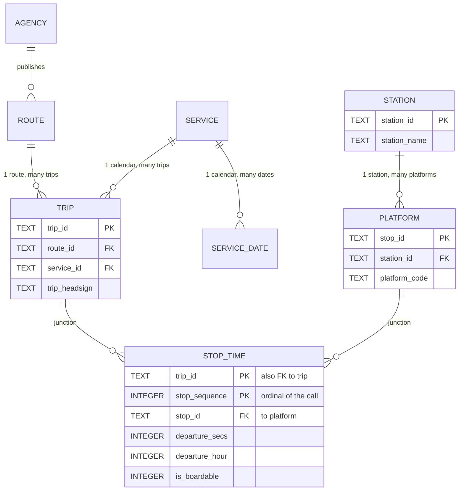
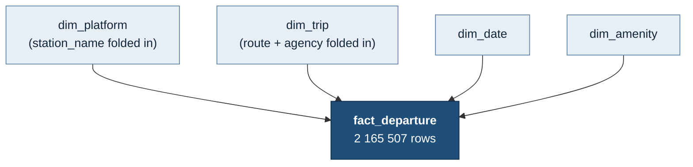
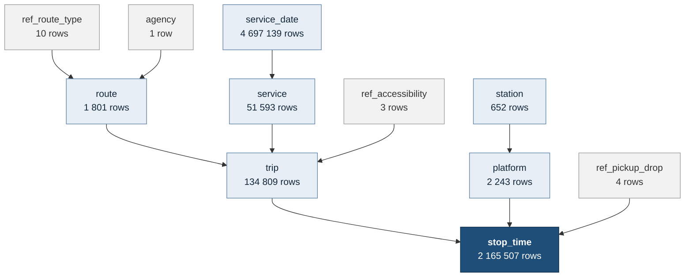
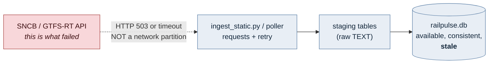

# 📑 SQL & Database Theory — the RailPulse study guide

Interview-prep notes for the *RailPulse: Belgian Transit SQL Analysis* challenge
(Sprint 1). Every claim here is checked against the database this repository
actually builds — `data/railpulse.db`, roughly 1 GB on disk (it varies with how much real-time data has accumulated; the static core alone is ~1 GB after the build's VACUUM),
SQLite 3.51.0, built from the SNCB/NMBS GTFS Static feed `nmbssncb` version
2026-07-20 covering 2025-12-20 to 2026-12-12. The exact byte count moves with the
WAL checkpoint state, so it is quoted to three significant figures and no more.

## How to revise this

The questions in this guide are asked out loud, in a room, with no laptop. What
gets you through that is not a memorised definition — it is one concrete
example you can talk about for ninety seconds. So each section below is built
the same way:

1. **The definition.** Two or three sentences. Learn this.
2. **The trade-off.** Every one of these questions is really "what did you give
   up?". An answer that only lists advantages sounds rehearsed.
3. **The worked example from this project.** Real table names, real row counts,
   real query plans. This is the part that turns a recited answer into a
   credible one.

Three practical suggestions:

- **Open the schema next to this file.** `sql/02_schema.sql` is the source of
  truth for §2 and §3; `sql/05_views.sql` for §5; `sql/03_transform.sql` for §4.
  This guide quotes them but does not replace them.
- **Re-run the query plans yourself.** Every `EXPLAIN QUERY PLAN` block below
  was produced by pasting the query into
  `sqlite3 -readonly data/railpulse.db`. If you have run one once, you will not
  freeze when asked what SEARCH means.
- **Learn five numbers, not fifty.** 2 165 507 stop_times · 4 697 139
  service_dates · 134 809 trips · 652 stations · 1 801 routes. Almost every
  answer in this guide hangs off one of those.

### Measurement methodology

Timings come from the `sqlite3` CLI's `.timer on`, median of three warm runs, on
an Apple Silicon laptop that was running other work at the time. Wall-clock
numbers are therefore noisy; **the ratios are the signal, not the absolute
values**, and where I/O noise dominates the CPU (`user`) time is quoted as well.
Query plans are deterministic and reproduce exactly.

---

## Table of contents

- [1. General Database Paradigms](#1-general-database-paradigms)
  - [1.1 SQL vs NoSQL](#11-sql-vs-nosql)
  - [1.2 The other engine families, and where SQLite sits](#12-the-other-engine-families-and-where-sqlite-sits)
  - [1.3 Fifty concurrent scrapers: why SQLite fails and what replaces it](#13-fifty-concurrent-scrapers-why-sqlite-fails-and-what-replaces-it)
- [2. Relational Schema & Data Modeling](#2-relational-schema--data-modeling)
  - [2.1 What is a data model?](#21-what-is-a-data-model)
  - [2.2 One-to-one, many-to-one, many-to-many](#22-one-to-one-many-to-one-many-to-many)
  - [2.3 Normalisation, and whether this database is normalised](#23-normalisation-and-whether-this-database-is-normalised)
  - [2.4 Primary Key vs Foreign Key vs Unique Key](#24-primary-key-vs-foreign-key-vs-unique-key)
- [3. Analytical Modeling & Architecture](#3-analytical-modeling--architecture)
  - [3.1 Fact vs dimension](#31-fact-vs-dimension)
  - [3.2 Star vs Snowflake](#32-star-vs-snowflake)
- [4. Theoretical Frameworks & Guardrails](#4-theoretical-frameworks--guardrails)
  - [4.1 ACID](#41-acid)
  - [4.2 CAP — and why "the API went down" is not a CAP problem](#42-cap--and-why-the-api-went-down-is-not-a-cap-problem)
- [5. Database Objects & Query Mechanisms](#5-database-objects--query-mechanisms)
  - [5.1 View vs Window function vs Subquery](#51-view-vs-window-function-vs-subquery)
  - [5.2 Index Scan vs Index Seek](#52-index-scan-vs-index-seek)
  - [5.3 SARGability](#53-sargability)
- [6. Advanced Query Optimization & Performance Tuning](#6-advanced-query-optimization--performance-tuning)
  - [6.1 The join-to-aggregated-subquery problem](#61-the-join-to-aggregated-subquery-problem)
  - [6.2 Four optimised alternatives, measured](#62-four-optimised-alternatives-measured)
  - [6.3 The same rewrite inside this project](#63-the-same-rewrite-inside-this-project)
- [Appendix A: every measurement in one table](#appendix-a-every-measurement-in-one-table)
- [Appendix B: the twelve numbers worth memorising](#appendix-b-the-twelve-numbers-worth-memorising)

---

# 1. General Database Paradigms

## 1.1 SQL vs NoSQL

**SQL (relational)** stores data as typed rows in tables with a schema declared
in advance, links them with keys, and is queried with a declarative language:
you state *what* you want and the engine's planner decides *how* to get it. The
engine enforces integrity — types, `NOT NULL`, `CHECK`, `UNIQUE`, foreign keys —
so bad data is rejected at write time rather than discovered at read time.

**NoSQL** is not one thing. It is a family of engines that each drop one of
those guarantees to buy something else: a fixed schema, or joins, or strong
consistency, or all three. Document stores (MongoDB) drop the schema so a record
can change shape without a migration. Key-value stores (Redis, DynamoDB) drop
joins so a lookup can be a single hash probe. Wide-column stores (Cassandra)
drop cross-partition consistency so writes can be accepted by any node.

| | Relational | NoSQL (typical) |
|---|---|---|
| Schema | Declared before the write; the engine rejects violations | Declared by the application, if at all |
| Joins | First-class, planner-optimised | Absent or expensive; you denormalise instead |
| Query language | SQL, declarative, portable | Engine-specific API |
| Consistency | ACID transactions across many rows and tables | Often eventual, often single-document only |
| Scaling model | Vertical first; horizontal is hard | Horizontal by design |
| Wins when | Relationships and correctness matter | Volume, write throughput and shape-churn matter |

**The trade-off, stated honestly.** A relational schema costs you a design phase
and a migration every time the shape changes. It buys you the ability to ask a
question nobody anticipated, in one query, and trust the answer.

**Worked example from this project.** The SNCB GTFS feed arrives as CSV and the
GTFS-RT feed as JSON, so a document store would ingest it with no design work at
all. Consider what the design work bought instead. Q5 asks: *what percentage of
trips per route guarantee bicycle storage, and which routes score lowest?* In
this schema that is one `GROUP BY` across `trip -> route -> ref_accessibility`
and the answer falls out: **123 051 of 134 809 trips (91.28 %) guarantee bike
storage, 11 758 (8.72 %) say nothing**, and the split is exactly by mode — every
one of the 123 051 `route_type = 2` (Rail) trips is a "yes", every one of the
11 758 `route_type = 3` (rail-replacement Bus) trips is "no information", across
all 270 bus routes.

The reference table is what makes that answer trustworthy. GTFS encodes
`bikes_allowed` as a bare integer where **0 means "no information", not "no"**
(DQ-02). In a document store the integer would sit in the JSON with nothing to
stop an analyst reading `0` as a refusal and reporting "8.72 % of trips refuse
bicycles" — which would be a fabricated fact. Here, `ref_accessibility` carries
an `is_guaranteed` flag and a foreign key forces every value to resolve against
it. The schema encodes the domain knowledge once, in one place, and no query can
route around it.

## 1.2 The other engine families, and where SQLite sits

"SQL vs NoSQL" is a false binary; the real landscape is a set of engines each
optimised for a different physical access pattern.

| Family | Optimised for | Typical engines | Where RailPulse would use one |
|---|---|---|---|
| **Row-store OLTP** | Many small reads/writes touching whole rows | PostgreSQL, MySQL, SQLite | The Sprint-1 core model, and Sprint 2's Azure PostgreSQL |
| **Column-store / OLAP** | Aggregating a few columns over hundreds of millions of rows | DuckDB, ClickHouse, BigQuery | `SUM(operating_days)` over the 2.2 M-row fact table; the Power BI model in Sprint 3 |

*(OLTP = **O**n**L**ine **T**ransaction **P**rocessing — lots of small,
concurrent reads and writes, e.g. booking a seat. OLAP = **O**n**L**ine
**A**nalytical **P**rocessing — a few big aggregations over huge tables, e.g.
this project's queries. A row-store keeps each row's columns together on disk,
which suits OLTP; a column-store keeps each column together, which suits OLAP.)*
| **Time-series** | Append-only, timestamp-ordered, windowed aggregation, retention policies | TimescaleDB, InfluxDB | `rt_stop_time_update` once the poller has been running for months |
| **Graph** | Traversal — "shortest path", "N hops from here" | Neo4j, Memgraph | Journey planning over `transfer` + `stop_time`; SQL needs a recursive CTE for this and it is painful |
| **Document** | Records whose shape varies per record | MongoDB, CouchDB | Landing raw GTFS-RT JSON before parsing |
| **Vector** | Nearest-neighbour search over embeddings | pgvector, Qdrant, FAISS | Sprint 4's text-to-SQL assistant, retrieving schema documentation by meaning |
| **Key-value** | Single-key lookup at microsecond latency | Redis, DynamoDB | Caching a station's liveboard between polls |

**Where SQLite sits.** SQLite is a relational, row-store, **embedded** engine.
The distinction that matters is not SQL-vs-NoSQL but *server-vs-embedded*:

- There is no server process. The library is linked into your program and reads
  and writes the database file directly. `src/railpulse/db.py` opening a
  connection is a `fopen`, not a network handshake.
- The whole database is one file. `data/railpulse.db` is roughly 1 GB and can be
  copied, checksummed, or emailed. There is no `pg_dump`.
- Configuration is zero. There are no users, roles, ports or `GRANT`s — which
  also means there is no server-side access control at all. File permissions are
  the security model.
- Concurrency is the price. See §1.3.

For a single-analyst analytical project that rebuilds its database from a
downloadable feed, that trade is close to ideal, and the assignment picked it
correctly. The moment a second process needs to write, it stops being ideal.

## 1.3 Fifty concurrent scrapers: why SQLite fails and what replaces it

### The mechanism

SQLite's locking is **database-wide, not row-wide**. At most one write
transaction can be open against a database file at any instant. That is not a
tunable; it is the design. Two journalling modes change *who else can read*
while that writer works:

- **Rollback journal** (`journal_mode = DELETE`, the default). The writer copies
  original pages into a `-journal` file, then takes an `EXCLUSIVE` lock on the
  main file to write. While that lock is held, **readers are blocked too**.
- **WAL** (`journal_mode = WAL`, which `db.py` sets on every read/write
  connection; it is a persistent property of the file, so read-only handles
  inherit it).
  The writer appends new pages to a `-wal` file instead of overwriting the main
  file. Readers keep reading the main file at the snapshot they started from, so
  **one writer and many readers run concurrently**. WAL solves reader/writer
  contention. It does **not** give you a second writer.

When a connection cannot get the lock it needs, SQLite returns **`SQLITE_BUSY`**
("database is locked"). `PRAGMA busy_timeout = N` makes the engine retry for N
milliseconds before giving up — it converts a hard error into a wait, which is
progress but not parallelism.

### Measured on this machine

Fifty processes, 200 `INSERT`s each (10 000 total), against a throwaway
database:

| Journal mode | Processes | `busy_timeout` | Rows landed (of 10 000) | Lost to `SQLITE_BUSY` | Wall time |
|---|---|---|---|---|---|
| Rollback (`DELETE`) | 50 | 0 ms | 435 | **9 565 (95.7 %)** | 0.53 s |
| WAL | 50 | 0 ms | 1 630 | **8 370 (83.7 %)** | 0.41 s |
| WAL | 50 | 30 000 ms | 10 000 | 0 | 1.41 s |
| WAL | **1** | 30 000 ms | 10 000 | 0 | **1.32 s** |

The first two rows are a race, so the exact loss counts move substantially
between runs — repeat runs of this harness lost anywhere from 84 % to 98 %. The
*shape* is stable, and it is the shape that answers the question. Read the four
rows in order, because each answers a different objection:

1. **Without a busy timeout, the overwhelming majority of writes are lost.** The
   scrapers do not queue politely; they raise `database is locked` and drop the
   record on the floor. Note how fast those first two runs are: they are quick
   precisely *because* they are not doing the work.
2. **WAL does not fix it.** Most writes still fail. WAL lets readers proceed
   during a write; the objection here is writer-versus-writer, which WAL does
   not address — there is still exactly one write lock.
3. **A generous `busy_timeout` does fix correctness.** Every row lands, because
   each process now waits its turn instead of giving up.
4. **But it buys no parallelism whatsoever.** Fifty processes complete the same
   10 000 inserts in 1.41 s against a single process's 1.32 s — *slower*, and the
   difference is pure lock-handoff overhead. This is the number that matters:
   adding writers to SQLite does not add throughput, because the writes are
   fully serialised by design. Fifty scrapers do not get you fifty times the
   ingest rate; they get you one scraper's ingest rate, shared fifty ways, plus
   contention.

The correct reading of row 4 is *not* "50 processes are 100× slower per
process" — that is just arithmetic from having split fixed work into fifty
pieces. It is "**total** throughput did not improve at all", which is the
property that makes SQLite the wrong engine for this workload.

And the reader story, with a large uncommitted write transaction open:

| Journal mode | Can a second connection read? |
|---|---|
| Rollback (`DELETE`) | **BLOCKED** — `database is locked` |
| WAL | **SUCCEEDS**, seeing the pre-transaction snapshot |

That last row is exactly why `db.py` sets WAL: it lets the Streamlit dashboard
query while `railpulse build` writes.

### What to migrate to, and why

**PostgreSQL**, and the reason is **MVCC — Multi-Version Concurrency Control**.

Instead of one global write lock, PostgreSQL keeps multiple *versions* of each
row. A writer never overwrites in place; it appends a new row version stamped
with its transaction id, and the old version stays visible to transactions that
started earlier. The consequences:

- **Readers never block writers and writers never block readers.** Every
  transaction sees a consistent snapshot without taking a lock on it.
- **Locks are per row, not per database.** Fifty scrapers inserting *different*
  train records contend on nothing at all: different rows, and in an append-only
  table usually different heap pages. Real throughput scales close to linearly
  with cores.
- **Genuine transaction isolation levels** (`READ COMMITTED` through
  `SERIALIZABLE`) rather than SQLite's one-writer-at-a-time approximation.
- **Server-side access control**, so the scrapers get an `INSERT`-only role and
  the dashboard gets a read-only one.

Concretely, for this project's Sprint 2 (which targets Azure Database for
PostgreSQL, so the migration is already on the roadmap):

- Keep the schema almost verbatim. `TEXT` becomes `text`, `INTEGER` becomes
  `integer` or `bigint`, `AUTOINCREMENT` becomes `GENERATED ALWAYS AS IDENTITY`,
  and `WITHOUT ROWID` is dropped (PostgreSQL has no equivalent — see §2.4).
- Put **PgBouncer** in front. Fifty scraper processes each holding an idle
  PostgreSQL connection is 50 backend processes; pooling turns that into a
  handful.
- Load bulk data with `COPY`, not row-at-a-time `INSERT`.
- **Partition `rt_stop_time_update` by date** once the real-time history grows,
  so retention is a `DROP PARTITION` rather than a `DELETE` of millions of rows.
- Add `TimescaleDB` if the delay history becomes the primary workload; it is a
  PostgreSQL extension, so this is not a second migration.

**Two honest alternatives worth mentioning in an interview**, because "migrate
to Postgres" as a reflex is a weaker answer than "migrate to Postgres, having
considered the cheaper options":

- **Keep SQLite and remove the concurrency instead.** Have the 50 scrapers write
  to a queue (or 50 separate files, or stdout) and run a *single* writer process
  that drains it. SQLite's single-writer limit stops being a limit when there is
  one writer by construction, and this preserves the zero-ops deployment. For a
  pipeline whose real bottleneck is the upstream API's rate limit — 100 requests
  per day anonymous, 10 per minute — this is very often the correct engineering
  answer.
- **Split the workload.** PostgreSQL for the write-heavy real-time ingest,
  DuckDB or a column-store for the analytical queries over the 4.7 M-row
  calendar. Note that DuckDB is *also* single-writer, so it solves the analytics
  problem and not the concurrency one.

---

# 2. Relational Schema & Data Modeling

## 2.1 What is a data model?

A data model is the deliberate decision about **what the rows mean**: which
real-world things get a table, what uniquely identifies one of them, how they
relate, and which states the database will refuse to store.

It is usually described at three levels:

| Level | Question it answers | RailPulse artefact |
|---|---|---|
| **Conceptual** | What things exist and how do they relate? | "A station has platforms; a trip calls at platforms; a trip belongs to a route and runs on a service calendar." |
| **Logical** | What are the tables, columns, keys and constraints? | The ER diagram in `README.md`; the `CREATE TABLE` statements in `sql/02_schema.sql` |
| **Physical** | How is it laid out on disk and accessed? | `WITHOUT ROWID` on `service_date`, the indexes in `sql/04_indexes.sql`, the materialised `departure_hour` column |

The critical point, and the one worth saying out loud in an interview: **a data
model is a set of refusals.** The interesting content of `02_schema.sql` is not
the columns, it is the things the database will not let you do — store a
`departure_hour` of 25, reference a route that does not exist, insert two calls
with the same `(trip_id, stop_sequence)`, or write an accessibility code that is
not 0, 1 or 2.

**Worked example of modelling as a decision, not a transcription.** GTFS ships
stations and platforms interleaved in a single `stops.txt` with a
`location_type` discriminator: `1` for a station, `0` for a boarding point.
Loading that file as one table would be transcription. It would also put two
different grains in one table — the thing a passenger calls
"Bruxelles-Central", and the six numbered tracks inside it. This model splits
them into `station` (652 rows) and `platform` (2 243 rows). That is a modelling
decision, and it is what makes Q2 — "the top 3 busiest platforms in
Brussels-Central" — a three-line query rather than a self-join with a
`location_type` filter.

## 2.2 One-to-one, many-to-one, many-to-many



### One-to-many (and its mirror, many-to-one): `station` → `platform`

One station owns many platforms; each platform belongs to exactly one station.
Implemented by putting the foreign key on the **many** side:

```sql
CREATE TABLE platform (
    stop_id       TEXT PRIMARY KEY,
    station_id    TEXT NOT NULL REFERENCES station(station_id),
    platform_code TEXT,               -- NULL = feed allocated no track
    ...
);
```

Real shape: 652 stations, 2 243 platforms. Of those, **1 591 carry a real
platform number and 652 do not** — because each station owns exactly one
`platform_code IS NULL` child, which the feed uses for calls where no track has
been allocated. Bruxelles-Central (`gs:nmbssncb:S8813003`) has six numbered
platforms plus that one unallocated child, and 1 348 of its timetabled calls
land on it.

"Many-to-one" is the same relationship read from the other end. `trip` →
`route` is the cleanest example: **134 809 trips across 1 801 routes**, average
75 trips per route, and `route_id` sits on `trip` because that is the many side.

### One-to-one

A one-to-one is a one-to-many where the FK column also carries a `UNIQUE`
constraint. There is no true one-to-one in this schema, and the reason is
instructive: **a genuine one-to-one is almost always a sign that two tables
should be one table.** The legitimate uses are vertical partitioning (split rarely
read blobs off a hot table) and subtype modelling.

The closest thing here is `feed_info`, which holds exactly one row for exactly
one feed. If the model grew to ingest De Lijn and TEC alongside SNCB, it would
become one-to-one with `agency` — and the right implementation would be
`feed_info.agency_id TEXT UNIQUE REFERENCES agency(agency_id)`. The `UNIQUE` is
the whole difference between one-to-one and one-to-many.

### Many-to-many, and why `stop_time` is the interesting case

A trip calls at many platforms. A platform is called at by many trips. Neither
table can hold the other's key, because a foreign key column holds exactly one
value. The resolution is a **junction table** (also: associative entity, bridge,
link table) holding one FK to each side.

`stop_time` **is** that junction — and it is worth being precise about what makes
it more than a pure junction:

```sql
CREATE TABLE stop_time (
    trip_id        TEXT    NOT NULL REFERENCES trip(trip_id),      -- side A
    stop_sequence  INTEGER NOT NULL,                               -- see below
    stop_id        TEXT    NOT NULL REFERENCES platform(stop_id),  -- side B
    departure_time TEXT,                    -- attribute of the association
    departure_secs INTEGER,                 -- attribute of the association
    departure_hour INTEGER,                 -- attribute of the association
    pickup_type    INTEGER NOT NULL REFERENCES ref_pickup_drop(code),
    is_boardable   INTEGER NOT NULL CHECK (is_boardable IN (0, 1)),
    PRIMARY KEY (trip_id, stop_sequence)
);
```

Three things to notice, because they are what an interviewer is probing for:

1. **The junction carries its own attributes.** "This trip calls at this
   platform" is not the whole fact; *when* it calls, and whether a passenger may
   board, are properties of the association itself and belong nowhere else. A
   junction table with attributes is sometimes called an *associative entity* —
   the relationship has been promoted to a thing in its own right.
2. **The primary key is `(trip_id, stop_sequence)`, not `(trip_id, stop_id)`.**
   This is the trap. A circular or out-and-back service calls at the same
   platform twice on one journey, so `(trip_id, stop_id)` is not unique.
   `stop_sequence` — the ordinal position of the call within the trip — is what
   makes the row identifiable, and it also gives the calls an order, which
   `stop_id` could never do. The lesson generalises: **the natural key of a
   junction table is often not just the two foreign keys.**
3. **The junction is where the volume is.** 2 165 507 rows, against 134 809 on
   one side and 2 243 on the other. That is normal, and it is why §3 calls this
   table the fact table.

**Illustration in the assignment's own vocabulary** ("Stations, Vehicles and
Departures"):

| Relationship | Cardinality | Implementation here |
|---|---|---|
| Station → Platform | one-to-many | `platform.station_id` FK |
| Departure (call) → Trip | many-to-one | `stop_time.trip_id` FK |
| Trip → Route | many-to-one | `trip.route_id` FK |
| Trip ↔ Platform | **many-to-many** | resolved by `stop_time` |
| Service ↔ Calendar day | **many-to-many** | resolved by `service_date`, 4 697 139 rows |
| Feed → Agency (hypothetical) | one-to-one | would need `UNIQUE` on the FK |

`service_date` is the second junction in this schema and is worth naming: a
service runs on many dates, a date hosts many services, and the junction carries
`exception_type` and the materialised `day_of_week` as its own attributes.

## 2.3 Normalisation, and whether this database is normalised

### What it is

Normalisation is the process of arranging columns so that **every non-key fact
depends on the key, the whole key, and nothing but the key** (Bill Kent's
formulation of 3NF, and the only one worth memorising). Each normal form removes
one class of *update anomaly* — a state where the same fact is stored twice and
the two copies can drift apart.

| Form | Rule | Anomaly it removes |
|---|---|---|
| **1NF** | Every cell holds a single atomic value; no repeating groups; no arrays or delimited lists | You cannot query, index or constrain the inside of a list |
| **2NF** | 1NF, and every non-key column depends on the *whole* composite key | A fact about half the key is duplicated on every row sharing that half |
| **3NF** | 2NF, and no non-key column depends on another non-key column | A fact about an attribute is duplicated on every row sharing that attribute |
| **BCNF** | Every determinant is a candidate key | Rare edge case with overlapping candidate keys |

### Why it matters

Not for elegance. For three concrete reasons:

1. **Update anomalies.** If a station's name were stored on all of its
   platforms, renaming "Bruxelles-Central" would be an `UPDATE` of up to seven
   rows, and any one of them failing leaves the database self-contradicting.
2. **The database can enforce meaning.** Once `route_type` lives in
   `ref_route_type`, a foreign key makes an unknown code impossible. Enforcement
   requires the fact to have a home.
3. **Storage and I/O.** Repeating a long station name on 2.2 M rows costs disk
   on every read and every backup.

The counter-pressure is that normalisation costs joins, and joins cost time.
Which is why the honest answer to "is your database normalised?" is never just
"yes".

### Is this project's database normalised, and how do I know?

**Yes, to 3NF, with one deliberate and documented exception.** Here is the
evidence, form by form, against real tables.

#### 1NF — atomic values, no repeating groups

*Where it was nearly violated.* The GTFS-RT alert feed publishes each alert's
header and description in four languages. The obvious shape is four columns:

```sql
-- NOT what this project does
CREATE TABLE rt_alert (
    rt_entity_id TEXT PRIMARY KEY,
    header_fr TEXT, header_nl TEXT, header_de TEXT, header_en TEXT
);
```

That is a repeating group: `header_1..header_n` flattened into columns. It fails
1NF, and it fails practically the day SNCB adds a fifth language — which needs a
schema migration, a rewrite of every query, and a backfill.

*What the schema does instead* (`sql/06_realtime.sql`):

```sql
CREATE TABLE rt_alert_text (
    snapshot_id  INTEGER NOT NULL,
    rt_entity_id TEXT    NOT NULL,
    field_name   TEXT    NOT NULL CHECK (field_name IN ('header', 'description')),
    language     TEXT    NOT NULL,
    text         TEXT    NOT NULL,
    PRIMARY KEY (snapshot_id, rt_entity_id, field_name, language),
    FOREIGN KEY (snapshot_id, rt_entity_id)
        REFERENCES rt_alert(snapshot_id, rt_entity_id) ON DELETE CASCADE
);
```

A fifth language is now a row, not a migration. `text_translation` (2 599 rows,
`nl`/`de`/`en` labels for station names and headsigns) applies the same pattern
to the static feed.

*The other 1NF decision:* empty strings. GTFS ships `''` for "absent", and DQ-08
converts those to `NULL` on load rather than storing a value that means "no
value". `stop_code`, `stop_url` and `zone_id` are empty on every row in this
feed and are not carried into the core model at all — a column that is empty
2 243 times out of 2 243 is not data.

#### 2NF — no partial dependency on a composite key

2NF only has teeth where the primary key is composite. This schema has three
such tables, so check each:

- **`stop_time`**, PK `(trip_id, stop_sequence)`. Every non-key column —
  `departure_time`, `stop_id`, `pickup_type`, `is_boardable` — depends on *both*
  parts. There is no fact here about a `trip_id` alone. Facts about the trip
  alone (`trip_headsign`, `route_id`, `bikes_allowed`) live on `trip`, one row
  per trip, not repeated across its ~16 calls.
- **`service_date`**, PK `(service_id, service_date)`. `exception_type` genuinely
  depends on both. `day_of_week` depends only on `service_date` — see the
  denormalisation note below, where it is accounted for honestly.
- **`text_translation`**, PK `(table_name, field_name, field_value, language)`.
  `translation` depends on the whole key.

*What a 2NF violation would have looked like:* putting `trip_headsign` on
`stop_time`. It depends on `trip_id` only, so it would be repeated 2 165 507
times instead of 134 809 times, and a corrected headsign would need an `UPDATE`
of every call of that trip.

#### 3NF — no transitive dependency

**This is the one with a concrete, verifiable story in this project.**

In `stops.txt`, every child stop carries a `stop_name`. The naive load puts it on
`platform`:

```sql
-- NOT what this project does
CREATE TABLE platform (
    stop_id    TEXT PRIMARY KEY,
    station_id TEXT REFERENCES station(station_id),
    stop_name  TEXT     -- <- transitively dependent: stop_id -> station_id -> name
);
```

That is a textbook transitive dependency: `stop_id` determines `station_id`,
`station_id` determines the name, so `stop_name` does not depend on `stop_id`
directly. It fails 3NF.

It was verified before being removed: **in this feed a child stop's `stop_name`
is always identical to its parent station's — 0 of 2 243 differ.** So the column
carried no information at all beyond what the FK already implies. `station_name`
therefore lives only on `station` (652 rows), and `platform` has no `stop_name`
column:

```console
$ sqlite3 -readonly data/railpulse.db \
    "SELECT COUNT(*) FROM pragma_table_info('platform') WHERE name='stop_name';"
0
```

*The second 3NF story: the `ref_` tables.* GTFS encodes meaning as bare integers.
Storing the label next to the code —

```sql
-- NOT what this project does
CREATE TABLE trip (..., bikes_allowed INTEGER, bikes_allowed_label TEXT);
```

— makes `bikes_allowed_label` depend on `bikes_allowed`, a non-key column: a
transitive dependency, repeated 134 809 times, and one that permits the state
`(1, 'No')`. The six `ref_` tables (`ref_location_type`, `ref_route_type`,
`ref_pickup_drop`, `ref_accessibility`, `ref_exception_type`,
`ref_transfer_type`) give each code-to-label mapping exactly one home, and the
`REFERENCES` clauses turn them from documentation into constraints.

#### The integrity check

Normalisation is a claim about *structure*. Referential integrity is a claim
about *content*, and it has to be tested separately:

```console
$ sqlite3 -readonly data/railpulse.db "PRAGMA foreign_key_check;"
$                       # no output = no orphan rows anywhere in the model
```

Worth saying explicitly: **SQLite does not enforce foreign keys unless
`PRAGMA foreign_keys = ON` is set on the connection.** It is off by default for
backwards compatibility. `src/railpulse/db.py` sets it on every single
connection; without that line every `REFERENCES` clause in `02_schema.sql` would
be a comment.

### The one deliberate denormalisation

`stop_time` carries three columns that are **derived**, not observed:

| Column | Derived from | Example |
|---|---|---|
| `departure_secs` | `departure_time` | `'24:20:00'` → `87600` |
| `departure_hour` | `departure_secs` | `87600` → `0` (that is, `(secs/3600) % 24`) |
| `is_boardable` | `pickup_type` | `pickup_type <> 1` → `1` |

Plus `service_date.day_of_week` (from `service_date`) and
`platform.has_platform_code` (from `platform_code IS NOT NULL`).

Strictly, every one of these is redundant: the value is a pure function of
another column in the same row. **They were stored on purpose, for
SARGability** (§5.3): a value computed inside a `WHERE` or `GROUP BY` cannot be
indexed, whereas a stored column can.

Be precise about *which* normal form each one breaks, because the two are not
the same and an interviewer may probe it:

- Columns derived from a **non-key** column are **3NF** violations (a transitive
  dependency: `stop_id → departure_time → departure_secs`). That is
  `departure_secs`, `departure_hour`, `is_boardable`, `has_platform_code`.
- `service_date.day_of_week` is different. `service_date`'s primary key is the
  **composite** `(service_id, service_date)`, and `day_of_week` depends on
  `service_date` — *part* of that key, not a non-key column. A dependency on
  part of a composite key is a **partial** dependency, which is a **2NF**
  violation, one normal form earlier than the others. Same decision, same
  justification; different rule broken, and worth naming correctly.

The cost, stated plainly:

- **Extra storage** on 2 165 507 rows.
- **A new failure mode.** If the transform's arithmetic is wrong, or someone
  `UPDATE`s `departure_time` without recomputing `departure_secs`, the table now
  contains two versions of one fact that disagree. Nothing in SQLite prevents
  this — SQLite has no `GENERATED ALWAYS AS ... STORED` enforcement on a plain
  column, and the mitigation here is that the columns are only ever written by
  `03_transform.sql`, which rebuilds the table from scratch, never patches it.
- **A wider row**, so a full table scan reads more pages.

The benefit, measured:

| Query over 2 165 507 rows | Wall (illustrative) | CPU |
|---|---|---|
| `GROUP BY departure_hour` (materialised) | **~0.1 s** | ~0.09 s |
| `GROUP BY CAST(substr(departure_time,1,2) AS INTEGER) % 24` (computed) | **~9 s warm, ~16 s cold** | ~0.7 s |

Both return the same 24 rows. Read the **CPU** column first, because it is the
stable one: the computed form burns ~8× the CPU, which is the per-row function
calls and does not depend on cache state. The **wall-clock** gap is much larger
(~100× warm, more when the 262 MiB table is cold) because the materialised form
is answered entirely from a covering index and never opens the table at all —
but that figure swings with page-cache state, so treat the ~8× CPU ratio as the
hard number and the wall-clock ratio as "one to two orders of magnitude". That
distinction is the real lesson, and §5.2 unpacks it.

**How to say this in an interview:** "3NF is the default and I can point at
where I enforced it. I broke it in exactly one place, for a measured reason, and
I isolated the risk by making those columns write-only from the transform."

## 2.4 Primary Key vs Foreign Key vs Unique Key

### Logical meaning

| | Primary Key | Unique Key | Foreign Key |
|---|---|---|---|
| **Asserts** | "This identifies the row" | "No two rows share this value" | "This value exists over there" |
| **NULLs** | Never *by the standard* — but see the SQLite caveat below | Allowed, and **each NULL is distinct**, so many are permitted | Allowed (means "no parent") |
| **Per table** | Exactly one | Any number | Any number |
| **Chosen for** | Stability; other tables reference it | Business rules that must not be violated | Referential integrity |

> ⚠️ **A SQLite trap the interviewer may be testing.** "A primary key is never
> NULL" is true in the SQL standard and in PostgreSQL, but **SQLite does not
> enforce it** for an ordinary rowid table — a `TEXT PRIMARY KEY` column will
> happily accept multiple NULL rows (verified: two NULLs insert into a
> `CREATE TABLE t(k TEXT PRIMARY KEY)` without error). The exceptions are an
> `INTEGER PRIMARY KEY` (which aliases the rowid and cannot be NULL) and any
> `WITHOUT ROWID` table (where the PK is genuinely NOT NULL). This is a
> long-standing documented SQLite quirk, not a bug. It is why this project
> declares its key columns `NOT NULL` explicitly where it matters, rather than
> trusting `PRIMARY KEY` to imply it — see §2.4's note on the schema.

The subtlety worth knowing: a table can have several *candidate* keys; the one
promoted to primary is the one other tables will reference, and it should be the
most stable. `transfer` is the example here — its natural GTFS key
`(from_stop_id, to_stop_id)` is *not* unique once trip-scoped transfers exist, so
the model uses a surrogate `transfer_id` as PK and puts the real business rule in
a `UNIQUE`:

```sql
CREATE TABLE transfer (
    transfer_id       INTEGER PRIMARY KEY AUTOINCREMENT,
    from_stop_id      TEXT NOT NULL REFERENCES platform(stop_id),
    to_stop_id        TEXT NOT NULL REFERENCES platform(stop_id),
    ...
    UNIQUE (from_stop_id, to_stop_id, from_trip_id, to_trip_id)
);
```

### Physical consequence in SQLite

This is where most candidates stop at "a PK is unique and not null" and lose the
question. SQLite implements these three constraints in three different ways.

#### A primary key may or may not create a separate B-tree

SQLite tables are B-trees. **Which key that B-tree is sorted on — the clustering
— depends on the PK's declared form**, and there are three distinct cases, all
three of which exist in this schema:

| Case | What SQLite does | Example in `02_schema.sql` |
|---|---|---|
| `INTEGER PRIMARY KEY` on a rowid table | The column **is** the rowid. The table B-tree is keyed by it. **No separate index.** True clustering. | `transfer.transfer_id`, `ingestion_run.run_id`, `rejected_row.rejected_id` |
| Any other PK on a rowid table | The table stays clustered on a hidden rowid; SQLite creates a **separate unique index** named `sqlite_autoindex_<table>_1`, so a PK lookup is *index seek then rowid fetch* — two B-tree descents. | `station`, `platform`, `route`, `trip`, `stop_time` |
| `WITHOUT ROWID` | The PK **is** the table. The row payload is stored in the PK B-tree. No separate index, one B-tree descent. | `service_date`, `text_translation` |

Verify it directly. Ask the schema which auto-indexes physically exist:

```console
$ sqlite3 -readonly data/railpulse.db "SELECT name FROM sqlite_schema
   WHERE type='index' AND name LIKE 'sqlite_autoindex%'
     AND tbl_name NOT LIKE 'rt_%' ORDER BY name;"
sqlite_autoindex_agency_1
sqlite_autoindex_feed_info_1
sqlite_autoindex_platform_1
sqlite_autoindex_platform_2
sqlite_autoindex_route_1
sqlite_autoindex_service_1
sqlite_autoindex_station_1
sqlite_autoindex_stop_time_1
sqlite_autoindex_transfer_1
sqlite_autoindex_trip_1
```

**`service_date` and `text_translation` are absent from that list**, despite both
having composite primary keys. That is the direct proof that a `WITHOUT ROWID`
table's PK is the table itself rather than an index over it. `transfer` appears
once, and it is `origin = 'u'` (from the `UNIQUE`), not `origin = 'pk'` — because
`transfer_id INTEGER PRIMARY KEY` is a rowid alias needing no index at all:

```console
$ sqlite3 -readonly -header -column data/railpulse.db "PRAGMA index_list('transfer');"
seq  name                         unique  origin  partial
---  ---------------------------  ------  ------  -------
0    sqlite_autoindex_transfer_1  1       u       0
```

**What `WITHOUT ROWID` is worth here.** `service_date` is 4 697 139 rows of
narrow data. Loading the identical rows into a rowid table with the same PK, and
into a `WITHOUT ROWID` table, and comparing the resulting files:

| Layout | File size |
|---|---|
| `WITHOUT ROWID` (PK is the table) | 197 795 840 bytes (189 MiB) |
| rowid table + `sqlite_autoindex_*` | 396 500 992 bytes (378 MiB) |
| **Saving** | **198 705 152 bytes (190 MiB, 50.1 %)** |

Half the file, because the rowid layout stores every key twice — once in the
index, once in the table — plus an integer rowid per row, and every lookup pays
an extra B-tree descent.

The trade-off, so this does not sound like free money: `WITHOUT ROWID` is only a
win when the PK is narrow and the rows are small. With a wide PK, every secondary
index has to carry the whole PK as its row pointer, and the space is paid back
with interest. It is also SQLite-specific — **PostgreSQL has no equivalent**, so
this line disappears in the Sprint 2 migration.

#### A unique key always creates a separate B-tree

`platform` shows both a PK index and a UNIQUE index side by side:

```console
$ sqlite3 -readonly -header -column data/railpulse.db "PRAGMA index_list('platform');"
seq  name                         unique  origin  partial
---  ---------------------------  ------  ------  -------
0    ix_platform_station          0       c       0
1    sqlite_autoindex_platform_2  1       u       0      <- UNIQUE (station_id, platform_code)
2    sqlite_autoindex_platform_1  1       pk      0      <- PRIMARY KEY (stop_id)
```

Two consequences:

- **A `UNIQUE` is an index you can query.** `sqlite_autoindex_platform_2` leads
  on `station_id`, so it can serve "all platforms at station X" as well as
  enforce the constraint.
- **A `UNIQUE` is an index you pay for on every write.** Each `INSERT` into
  `platform` maintains three B-trees.

**And the NULL trap.** `UNIQUE (station_id, platform_code)` does **not** prevent
a station from having two platforms with a NULL `platform_code`, because SQL
treats each NULL as distinct. That the feed happens to supply exactly one per
station is data, not a constraint:

```console
$ sqlite3 -readonly data/railpulse.db \
    "SELECT MIN(n), MAX(n) FROM (SELECT COUNT(*) n FROM platform WHERE platform_code IS NULL GROUP BY station_id);"
1|1
```

If that rule mattered, it would need a partial unique index —
`CREATE UNIQUE INDEX ... ON platform(station_id) WHERE platform_code IS NULL`.

#### A foreign key creates nothing at all — the classic performance bug

**Declaring `REFERENCES` does not create an index on the child column.** Not in
SQLite, not in PostgreSQL, not in MySQL/InnoDB (which is the exception — it
*does* auto-create one, which is why developers who learned on MySQL are
routinely caught out elsewhere).

Two things go wrong, and they are separate bugs:

**Bug 1 — reads.** "Find everything belonging to this parent" is the single most
common query shape in an application, and without a child-side index it is a full
scan of the child table. Live proof, using SQLite's `NOT INDEXED` hint to
simulate the index not existing:

```console
$ sqlite3 -readonly data/railpulse.db
sqlite> EXPLAIN QUERY PLAN
   ...> SELECT COUNT(*) FROM stop_time WHERE stop_id = 'gs:nmbssncb:8813003_4';
QUERY PLAN
`--SEARCH stop_time USING COVERING INDEX ix_stop_time_stop_boardable (stop_id=?)

sqlite> EXPLAIN QUERY PLAN
   ...> SELECT COUNT(*) FROM stop_time NOT INDEXED WHERE stop_id = 'gs:nmbssncb:8813003_4';
QUERY PLAN
`--SCAN stop_time
```

| Form | Plan | Median of 3 | Result |
|---|---|---|---|
| With `ix_stop_time_stop_boardable` | `SEARCH ... (stop_id=?)` | **0.001 s** | 10 515 |
| `NOT INDEXED` (what the FK alone gives you) | `SCAN stop_time` | **1.838 s** | 10 515 |

Same answer, **~1 800× slower**. `stop_time.stop_id` is a declared foreign key
to `platform(stop_id)`; the FK contributed nothing to that speed. The index in
`sql/04_indexes.sql` did.

Unindexed FKs do still exist in this schema, and they are worth being honest
about rather than pretending otherwise. The clearest one is
`transfer.to_stop_id`.

```console
sqlite> EXPLAIN QUERY PLAN SELECT * FROM transfer WHERE from_stop_id = 'gs:nmbssncb:8813003_4';
QUERY PLAN
`--SEARCH transfer USING INDEX sqlite_autoindex_transfer_1 (from_stop_id=?)

sqlite> EXPLAIN QUERY PLAN SELECT * FROM transfer WHERE to_stop_id = 'gs:nmbssncb:8813003_4';
QUERY PLAN
`--SCAN transfer
```

`from_stop_id` seeks because it is the leading column of the `UNIQUE`;
`to_stop_id` scans because it is not. On 733 rows that is irrelevant, and adding
an index nobody has a query for would be technical debt — but it is the same bug,
and on a million-row table it would be a production incident.

It is not the only one. Every FK pointing at a `ref_` table is unindexed on the
child side too — `stop_time.pickup_type` and `stop_time.drop_off_type` on
2 165 507 rows, `trip.bikes_allowed`, `trip.wheelchair_accessible`,
`route.route_type`, `service_date.exception_type`,
`station.wheelchair_boarding` — and so are `route.agency_id`,
`transfer.transfer_type`, `transfer.from_trip_id` / `to_trip_id` and
`rejected_row.run_id`. Each is a deliberate omission with the same shape of
justification: the parent is a 2-to-10-row code list (or the single `agency`
row) that is seeded once and never deleted from, so the write-side scan below
never fires; and nobody filters a 2.2 M-row table by `pickup_type` alone, so
the read-side case never arises either. Naming the exceptions and why they are
safe is a better answer than claiming there are none.

**Bug 2 — writes.** With `PRAGMA foreign_keys = ON`, every `DELETE` or key
`UPDATE` on a **parent** row forces SQLite to check the child table for
dependents. Without a child-side index that check is a full scan of the child
table *per parent row touched*. Deleting 100 platforms from a 2.2 M-row
`stop_time` with no index on `stop_id` is 220 million row reads. This is the
version of the bug that shows up as "why does our nightly cleanup take four
hours", and it is invisible in any `SELECT` benchmark.

**The rule to state in an interview:** *index every foreign key on the child
side unless you can name why you have not.* This project follows it —
`ix_stop_time_stop_boardable` for `stop_time.stop_id`, `ix_trip_service` for
`trip.service_id`, `ix_trip_route_amenity` leading on `trip.route_id`,
`ix_platform_station` for `platform.station_id`; `stop_time.trip_id` and
`service_date.service_id` need no index because they lead their tables' primary
keys. Where it does not follow the rule, the reason is named above: a 733-row
child, or a code-list parent nobody deletes from.

---

# 3. Analytical Modeling & Architecture

## 3.1 Fact vs dimension

| | Fact table | Dimension table |
|---|---|---|
| **Holds** | Events or measurements — things that *happened* | Descriptive context — things that *are* |
| **Grain** | One row per event, stated explicitly | One row per entity |
| **Size** | Millions to billions; grows with time | Hundreds to millions; grows with the business |
| **Non-key columns** | Numeric, additive **measures** | Textual, descriptive **attributes** |
| **Keys** | Mostly foreign keys to dimensions | A primary key, few or no outbound FKs |
| **Changes** | Append-only; a past event does not change | Updated in place, or versioned (slowly changing dimensions) |
| **Queried by** | `SUM`, `COUNT`, `AVG` over many rows | `WHERE`, `GROUP BY`, and as join targets |

### Which is `stop_time` / `departures`?

**`stop_time` is the fact table.** Four independent tests, all of which it
passes:

1. **It has an event grain, and the grain is stateable in one sentence.** "One
   scheduled call of one trip at one platform." Every fact table design starts
   by writing that sentence down; if you cannot, you do not have a fact table.
2. **It is one of only two tables with millions of rows, and the only one at
   event grain.** 2 165 507, against 134 809 trips, 2 243 platforms, 1 801
   routes and 652 stations. The other million-row table, `service_date`, is a
   fact table too — at calendar grain rather than event grain. Together they are
   6.86 M of the 7.06 M rows in the entire model.

   | Table | Rows | Role |
   |---|---|---|
   | `service_date` | 4 697 139 | fact (calendar grain) |
   | `stop_time` | **2 165 507** | **fact (event grain)** |
   | `trip` | 134 809 | dimension |
   | `service` | 51 593 | dimension |
   | `text_translation` | 2 599 | dimension |
   | `platform` | 2 243 | dimension |
   | `route` | 1 801 | dimension |
   | `transfer` | 733 | fact (bridge) |
   | `station` | 652 | dimension |
   | `agency` | 1 | dimension |

3. **Its non-key columns are measures, not descriptions.** `departure_secs`,
   `departure_hour`, `arrival_secs`, `day_offset`, `is_boardable`,
   `is_alightable` — numeric, and the flags are pre-aggregated indicators
   designed to be `SUM`med. The descriptive text (`station_name`,
   `trip_headsign`, `route_long_name`) is deliberately *not* here; it is one join
   away, which is exactly the 3NF decision from §2.3.
4. **Its keys are all foreign keys to dimensions.** `trip_id` → `trip`,
   `stop_id` → `platform`, `pickup_type`/`drop_off_type` → `ref_pickup_drop`.
   The table is a bundle of dimension references plus measures — the canonical
   fact-table shape.

**A nuance worth raising, because it shows you understand the vocabulary rather
than reciting it.** `stop_time` is a *scheduled* fact — it records what the
timetable says will happen, not what did. In warehouse terms it is a **planned
or "snapshot" fact table**; the corresponding **transaction fact table** is
`rt_stop_time_update`, which records observed delays from the GTFS-RT feed. The
whole point of `v_rt_departure_performance` is to join plan to actual, which is
the classic warehouse pattern of comparing a plan fact to an accumulating fact.

**And a second nuance, which is the actual analytical finding of Q1.** The grain
of `stop_time` is "one row per timetabled call", **not** "one row per departure".
The SNCB feed describes 358 distinct dates, and each of the 134 809 trips carries
its own service calendar, so a summer-Sunday excursion and a Monday-to-Friday
commuter train are one row each. `COUNT(*)` therefore measures rows in a file,
not trains leaving a platform. Weighting each call by
`v_trip_service_days.operating_days` converts one to the other, and the answer
changes materially:

| Hour | Annualised departures | Rank | Timetable rows | Rank | Move |
|---|---|---|---|---|---|
| **17:00** | **950 651** | **1** | 76 736 | 10 | **+9** |
| 07:00 | 938 525 | 2 | 76 473 | 12 | +10 |
| 16:00 | 919 919 | 3 | 77 203 | 9 | +6 |
| 10:00 | 830 433 | 8 | **94 323** | **1** | **-7** |
| 11:00 | 821 634 | 12 | 91 782 | 2 | -10 |

The naive count says the network peaks at **10:00**. The annualised count says
**17:00**, with 950 651 departures — **6.51 %** of the 14 603 218 boardable
departures in the feed year — and 07:00 second. Both commuter peaks are invisible
in the raw count, and both are exactly what a rail planner would expect. **The
grain of a fact table is the first thing you state and the first thing that
misleads you if you get it wrong.**

## 3.2 Star vs Snowflake

### Star schema

One central fact table joined directly to a ring of **denormalised** dimensions.
Every dimension is one hop from the fact.



- **Fewer joins**, so simpler SQL and a smaller search space for the planner.
- **Redundant text**, so a larger dimension and update anomalies if a name
  changes — acceptable, because a warehouse is rebuilt from a source of truth
  rather than edited in place.
- BI tools assume this shape. Power BI, the Sprint 3 target, models star
  natively.

### Snowflake schema

Dimensions are themselves normalised into sub-dimensions, so reaching an
attribute takes several hops. It is a star with 3NF applied to the dimensions.



### This schema is snowflaked, and `station -> platform -> stop_time` is the proof

That chain is literally a snowflaked dimension. The fact references
`platform`; `platform` references `station`; `station` holds the name. Getting
"how many departures from Bruxelles-Central?" costs two hops, not one:

```sql
SELECT COUNT(*)
FROM stop_time st
JOIN platform p ON p.stop_id    = st.stop_id      -- hop 1
JOIN station  s ON s.station_id = p.station_id    -- hop 2
WHERE s.station_name = 'Bruxelles-Central';
```

The star equivalent would fold `station_name` into a single `dim_platform`,
repeating "Bruxelles-Central" on seven rows and answering in one hop.

`trip -> route -> agency` and `trip -> service -> service_date` are two more
snowflaked chains, and the six `ref_` tables are outriggers snowflaked off both
the fact and the dimensions.

| | Star | Snowflake | What RailPulse chose |
|---|---|---|---|
| Joins per question | Fewest | More | More — accepted |
| Dimension storage | Redundant text | Minimal | Minimal |
| Update anomalies | Possible | Prevented by structure | Prevented |
| Query readability | Highest | Lower | Lower — mitigated by views |
| BI tool fit | Native | Needs flattening | Flattened in `05_views.sql` |
| Source-fidelity | Lower | Higher | Higher |

**Why snowflake was right here, and the honest cost.** Sprint 1's brief is
explicit: *"Database tables are correctly normalized with Foreign Keys."* The
schema is a normalised operational store first and an analytical store second,
and it has to round-trip a third-party feed faithfully enough that a rebuild is
verifiable. Snowflaking follows from that.

The cost is real. Every analytical query pays the extra hops, and analysts
writing five-table joins by hand will eventually write four of them slightly
differently. **`sql/05_views.sql` is the mitigation**: `v_departure` pre-joins
`stop_time -> platform -> station -> trip -> route -> ref_route_type` and hands
back a flat, star-shaped row. The snowflake is the storage model; the star is
the presentation model; the view is the seam between them. That is the standard
answer to "why not just denormalise", and §5.1 shows the query plan proving the
view costs nothing to interpose.

---

# 4. Theoretical Frameworks & Guardrails

## 4.1 ACID

Four guarantees a transaction gives you.

| Letter | Guarantee | If it were missing |
|---|---|---|
| **Atomicity** | All statements in the transaction commit, or none do | A crash leaves a half-finished write |
| **Consistency** | The database moves from one valid state to another; declared constraints hold at commit | An orphan row, a `departure_hour` of 25 |
| **Isolation** | Concurrent transactions do not see each other's uncommitted work | An analyst reads a half-loaded table |
| **Durability** | Once committed, the data survives a crash or power cut | An acknowledged write vanishes |

SQLite is fully ACID. That is the headline feature it has over most NoSQL
engines, and it is unusual for an embedded database.

### A failure example from this project's ingestion

`sql/03_transform.sql` copies staging into the core model: `feed_info`, then
`agency`, `station`, `platform`, `route`, `service`, `service_date` (4.7 M rows),
`trip`, `stop_time` (2.2 M rows), `transfer`, `text_translation` — in dependency
order, because the foreign keys require parents to exist first.

The entire file runs inside **one transaction**, opened by
`src/railpulse/db.py`:

```python
def run_sql_file(conn, path, *, atomic=True, echo=False):
    ...
    if atomic:
        conn.execute("BEGIN")
    try:
        for statement in statements:
            conn.execute(statement)
    except Exception:
        if atomic:
            conn.rollback()
        raise
    else:
        if atomic:
            conn.commit()
```

**The scenario.** The build is 90 % of the way through the `stop_time` insert —
roughly 1.9 M of 2 165 507 rows written — and the laptop's battery dies, or the
process is killed, or a row violates
`CHECK (departure_hour IS NULL OR departure_hour BETWEEN 0 AND 23)` because a
future feed introduces a value the transform does not expect.

**Without the transaction**, that database is now worse than empty. It contains:

- a partially populated `stop_time`, silently missing ~265 000 calls;
- `transfer` and `text_translation` never loaded at all;
- and — this is the part that actually costs you — **no visible symptom**. Every
  query still runs. Q1 still returns a peak hour. It is just wrong, by an amount
  nobody can quantify, and there is nothing in the output to suggest it. A
  crashed build that leaves a working-looking database is far more dangerous than
  one that leaves no database.

**With the transaction**, `conn.rollback()` discards every page written since
`BEGIN`. The database on disk is byte-for-byte what it was before the build
started. The error propagates, `railpulse build` exits non-zero, and the
`ingestion_run` row is marked `failed`. You fix the cause and re-run. **This is
the 'A' of ACID doing real work**, and the header comment of `03_transform.sql`
says so.

The mechanism is the journal. In WAL mode the new pages are appended to
`railpulse.db-wal` and only become visible when the commit record is written; a
crash before that leaves the main file untouched. On restart SQLite reads the WAL
header, sees no commit, and ignores everything after it. Durability is the mirror
image: a commit is acknowledged only once the WAL write has reached storage.

**Two implementation details in this project that exist because of ACID:**

1. **`executescript()` is deliberately not used.** `db.py` explains why:
   `sqlite3.Connection.executescript()` issues an implicit `COMMIT` before it
   runs, which would silently break the all-or-nothing guarantee. Instead
   `iter_statements()` splits the file with `sqlite3.complete_statement()` — the
   engine's own tokenizer-aware check, chosen because naively splitting on `;`
   breaks the moment a semicolon appears inside a comment, and this project's SQL
   is heavily commented. **Atomicity is not something you get by writing `BEGIN`;
   it is something you can lose by using the wrong API.**
2. **`synchronous = NORMAL`, and `OFF` during bulk load** — a deliberate,
   documented weakening. Be precise about what `OFF` actually risks, because it
   is more than durability. With `synchronous = OFF` SQLite does not wait for
   the OS to flush to disk before moving on, so a power cut or OS crash
   mid-write can leave the database file **corrupt** — not merely missing the
   last transaction (that would be a pure durability loss) but structurally
   broken, which takes **atomicity** down with it. The SQLite documentation says
   this plainly. So the honest statement is: `OFF` trades durability *and* the
   crash-safety of atomicity, and it is acceptable here for exactly one reason —
   the store is **fully rebuildable from the feed**, so the worst case is
   `make build`, not corrupted customer data. During normal operation the
   connection runs at `NORMAL` (safe against application crashes, exposed only to
   an OS/power failure), and `OFF` is scoped to the bulk load alone. This is the
   right shape for a disposable analytical store and catastrophically wrong for a
   payments ledger.

**Where the 'C' shows up as a design choice.** DQ-01 to DQ-09 in
`03_transform.sql` are consistency rules the engine cannot express. Rather than
letting a bad row abort the whole 2.2 M-row load, they route it to
`rejected_row` with the file, line number, rule code and the original payload as
JSON. In this feed exactly one rule fired:

```console
$ sqlite3 -readonly data/railpulse.db "SELECT rule_code, COUNT(*) FROM rejected_row GROUP BY 1;"
DQ-03-IMPLAUSIBLE-DEPARTURE|12
```

Twelve calls at 48:00:00 or later into their own service day — the quarantined
payloads run from 63:18:00 to 87:39:00.
Everything else loaded. **Quarantine, not deletion** — the rows are inspectable,
and the count is auditable. That is consistency implemented as a policy rather
than as a constraint, which is what you do when the rule is about plausibility
rather than about structure.

## 4.2 CAP — and why "the API went down" is not a CAP problem

### The theorem, stated correctly

Brewer's CAP theorem concerns a **distributed data store that replicates data
across nodes**. Under a **network partition** — messages between nodes are being
dropped — the system can guarantee at most one of:

- **Consistency (C):** every read returns the most recent committed write, as
  though there were a single copy. This is *linearizability*, and it is not the
  same "C" as in ACID. Different word, different meaning; do not confuse them in
  an interview.
- **Availability (A):** every request to a **non-failing** node gets a non-error
  response.

Partition tolerance is **not a choice**. Networks drop packets; if your data
lives on more than one machine, partitions will happen. So the real statement is
narrower than the popular "pick two":

> **When a partition occurs, you must choose: refuse to answer (CP), or answer
> from possibly-stale data (AP).**

Examples: PostgreSQL with synchronous replication is CP — it stops accepting
writes rather than diverge. Cassandra and DynamoDB are AP — they accept writes on
both sides and reconcile later. MongoDB with a majority write concern is CP.

**PACELC** is the refinement worth naming: *if Partitioned, choose Availability
or Consistency; **Else** (normal operation) choose Latency or Consistency.* It is
better than CAP because most systems spend approximately none of their life
partitioned, and the latency-versus-consistency trade is the one you actually
make every day.

### Where a single-node SQLite sits

**It has no P to trade, because there is nothing to partition.** One process,
one file, one copy. There is no replica to disagree with, no split brain, no
quorum.

The conventional shorthand is to call it "CA". The more precise answer, and the
one that shows you understand the theorem rather than the diagram, is:

> **CAP does not apply. It is a theorem about replicated distributed systems,
> and this is a single-node embedded database.** Its consistency guarantee comes
> from ACID, not from CAP. Its availability is bounded by whether the process is
> running and whether the file lock is free.

The nearest thing to a CAP-shaped problem in a single-node SQLite is
`SQLITE_BUSY` under write contention (§1.3) — but that is a *lock*, not a
partition, and the reason it is not a partition is that all parties can still
communicate perfectly. They are queueing, not diverging.

### So what actually happens when the iRail/GTFS API goes offline mid-scrape?

**This is not a CAP scenario, and identifying that is the point of the
question.**

CAP is about disagreement *between replicas of your data*. Here there is one
copy of the data and it is not in disagreement with anything. What has failed is
an **upstream source system** — a service your pipeline reads *from*, entirely
outside your database's trust boundary.



During the outage the database is:

- **Available.** Every query answers. The dashboard works.
- **Consistent.** Every constraint holds; `PRAGMA foreign_key_check` is clean.
- **Stale.** It reflects the last successful poll and nothing after it.

Staleness is not one of CAP's three letters. The property actually at risk is
**freshness**, and the second one is **completeness of the ingest** — did we
lose the observations that happened during the outage, and is what we did write a
whole feed or half of one?

Both are *pipeline* design problems, and both have concrete answers in this
repository.

### The right engineering answer

**1. Idempotent retries with backoff, and never a partial write.**

A failed poll must be safe to repeat. `ingestion_run` records every attempt —
`http_status`, `bytes_downloaded`, `source_last_modified`, and a `status` column
constrained to `('running', 'ok', 'failed')` — so a crashed run is visibly
`running` or `failed` rather than silently absent, and "when did we last have
good data?" is a query rather than a guess. Respect the upstream's limits while
retrying: the anonymous quota is 100 requests/day and 10/minute, so a tight retry
loop turns a transient outage into a rate-limit ban, which is a self-inflicted
second outage.

**2. The `rt_snapshot` UNIQUE guard — idempotency enforced by the schema, not by
the caller.**

```sql
CREATE TABLE rt_snapshot (
    snapshot_id          INTEGER PRIMARY KEY AUTOINCREMENT,
    feed                 TEXT    NOT NULL CHECK (feed IN ('trip-update', 'alert')),
    fetched_at_utc       TEXT    NOT NULL,
    feed_timestamp_epoch INTEGER,          -- header.timestamp: when THEY built it
    ...
    UNIQUE (feed, feed_timestamp_epoch)
);
```

The upstream feed refreshes about every 30 seconds. If the poller retries after a
timeout, or a cron run overlaps a manual one, or the API recovers and serves the
same payload it served before the outage, the identical `feed_timestamp_epoch`
comes back and the insert is **rejected by the constraint**. Without it, a retry
storm during a flaky period would double- and triple-count every delay
observation and quietly corrupt the punctuality statistics.

Note the design choice: the key is the **publisher's** timestamp
(`feed_timestamp_epoch`), not our `fetched_at_utc`. Keying on our own clock would
make every retry look like new data — which is exactly the bug the constraint is
there to prevent.

**3. Staging plus one transaction — a truncated download never becomes a
truncated fact table.**

The static pipeline lands raw CSV in `stg_*` tables (all `TEXT`, no constraints)
and only then runs `03_transform.sql` inside a single transaction. If the HTTP
stream dies at 60 % of `stop_times.txt`, staging holds a partial file, the
transform's constraints fail, the transaction rolls back, and the core model is
untouched. The failure is loud and the previous good data survives. **This is
§4.1's atomicity used as an availability strategy: the guarantee you actually
want is not "the ingest always succeeds" but "a failed ingest never damages what
you already had".**

**4. Soft links where a hard FK would reject the truth.**

`rt_trip_update.trip_id` is deliberately **not** a foreign key. The static feed is
regenerated daily; the real-time feed references whatever timetable is live right
now. Between an upstream publish and our next `make build`, real-time rows
legitimately name trips our static snapshot has never seen. A hard FK would
reject exactly the observations that matter most — a brand-new or re-planned
service — and would cascade-delete history on rebuild. The link is instead *soft
but measured*: `railpulse verify` reports what percentage of real-time trips
resolve, and `v_rt_departure_performance` `INNER JOIN`s so punctuality queries
silently and correctly ignore unmatched rows. **Knowing when *not* to declare a
foreign key is part of knowing what foreign keys are for.**

**5. Date every number you publish.** `feed_info` carries `feed_start_date`,
`feed_end_date` and `feed_version` so a report can say "SNCB feed 2026-07-20,
valid 2025-12-20 to 2026-12-12" rather than presenting stale data as current.
When freshness is the property at risk, making freshness visible is a control.

### The one-paragraph interview answer

> CAP is about replicated distributed systems: under a network partition between
> nodes you choose consistency or availability. A single-node SQLite has no
> replicas, so there is no partition to tolerate and CAP does not really apply —
> its consistency comes from ACID instead. An upstream API going offline is not
> a CAP partition at all; it is an availability failure in a *source* system.
> Our database stays fully available and fully consistent, it just goes stale.
> The properties at risk are freshness and ingest completeness, and the answers
> are engineering ones: idempotent retries with backoff, a uniqueness constraint
> on the publisher's own feed timestamp so a replayed payload cannot be
> double-counted, staging plus a single transaction so a truncated download
> rolls back instead of half-loading the fact table, and recording feed
> provenance so every published number is dated.

---

# 5. Database Objects & Query Mechanisms

## 5.1 View vs Window function vs Subquery

These three get conflated because all three "wrap a query". They solve different
problems.

| | View | Window function | Subquery |
|---|---|---|---|
| **What it is** | A stored, named `SELECT` | A per-row calculation over a set of related rows | A query nested inside another |
| **Stores data?** | No (in SQLite, never) | n/a | No |
| **Collapses rows?** | n/a | **No** — unlike `GROUP BY` | Depends on form |
| **Scope** | Database-wide, reusable | One query | One query |
| **Choose it for** | A definition many queries must share | Ranking, running totals, "row vs its group" | A one-off intermediate result |

### View — a named join, not a cached table

The most common misconception is that a view stores something. In SQLite it
never does; there are no materialised views. A view is a macro that the planner
**expands and flattens into the calling query**, after which predicates from the
outer query are pushed all the way down into the base tables.

That is worth proving rather than asserting. `v_departure` joins six tables.
Filter it to one station:

```console
$ sqlite3 -readonly data/railpulse.db
sqlite> EXPLAIN QUERY PLAN
   ...> SELECT COUNT(*) FROM v_departure WHERE station_id = 'gs:nmbssncb:S8813003';
QUERY PLAN
|--SEARCH s USING COVERING INDEX sqlite_autoindex_station_1 (station_id=?)
|--SEARCH p USING INDEX ix_platform_station (station_id=?)
|--SEARCH st USING INDEX ix_stop_time_stop_boardable (stop_id=? AND is_boardable=?)
|--SEARCH t USING INDEX sqlite_autoindex_trip_1 (trip_id=?)
|--SEARCH r USING INDEX sqlite_autoindex_route_1 (route_id=?)
`--SEARCH rt USING INTEGER PRIMARY KEY (rowid=?)
```

**Six `SEARCH`es and not one `SCAN`.** The view was not computed and then
filtered; the `station_id` predicate was pushed through all six joins and every
one of them became an index seek. Interposing the view cost nothing.

Why `v_departure` exists is a semantic argument, not a performance one. It fixes
the definition of "a departure" in one place:

```sql
CREATE VIEW v_departure AS
SELECT st.trip_id, st.stop_id, p.station_id, s.station_name, p.platform_code,
       st.departure_hour, t.route_id, t.trip_headsign, r.route_type, ...
FROM stop_time st
JOIN platform p ON p.stop_id = st.stop_id
JOIN station  s ON s.station_id = p.station_id
JOIN trip     t ON t.trip_id = st.trip_id
JOIN route    r ON r.route_id = t.route_id
JOIN ref_route_type rt ON rt.route_type = r.route_type
WHERE st.is_boardable = 1               -- drops 712 286 non-boardable calls
  AND st.departure_secs IS NOT NULL;
```

Those two `WHERE` lines are the whole argument. `is_boardable = 1` keeps
1 453 221 of the 2 165 507 calls and drops 712 286 — every call with
`pickup_type = 1`, i.e. every call where nobody may get on. **577 462 of those
712 286 are full technical pass-throughs** (`pickup_type = 1 AND
drop_off_type = 1`): the train physically serves the platform and nobody may
board *or* alight. The remaining 134 824 are drop-off-only calls, mostly
terminus arrivals. Counting all 712 286 as departures inflates the network total
by 49 % (2 165 507 against 1 453 221). Once the rule lives in the view, no
analyst can forget it, and if the definition ever changes it changes once.

*The trade-off:* a view is recomputed on every call, so an expensive view called
in a loop is an expensive loop. SQLite's answer when you need materialisation is
`CREATE TABLE ... AS SELECT` plus a rebuild step (§6.2); PostgreSQL's is
`CREATE MATERIALIZED VIEW ... REFRESH`.

### Window function — an aggregate that does not collapse rows

`SUM(x)` with `GROUP BY` returns one row per group and throws the detail away.
`SUM(x) OVER (PARTITION BY g)` returns **every** detail row with the group's
total attached. That is the entire distinction, and it is the reason window
functions exist.

`v_trip_origin` is the example the assignment cares about. Q3 asks for morning
trips, and "a trip that departs before 12:00" is a statement about where the trip
*starts*, not about every intermediate station it happens to leave in the
morning. So: rank each trip's calls by `stop_sequence`, keep rank 1.

```sql
CREATE VIEW v_trip_origin AS
SELECT trip_id, stop_sequence, station_name, departure_secs, trip_headsign, ...
FROM (
    SELECT d.*,
           ROW_NUMBER() OVER (PARTITION BY d.trip_id
                              ORDER BY d.stop_sequence) AS call_rank
    FROM v_departure d
)
WHERE call_rank = 1;
```

`GROUP BY trip_id` cannot do this: `MIN(stop_sequence)` gives the *number* but
not the `station_name`, `trip_headsign` or `departure_secs` of that row, and
selecting them alongside a bare `MIN()` is either an error or, in SQLite's
permissive dialect, silently arbitrary.

Q1 uses windows for a second reason — the percentage-of-total idiom:

```sql
ROUND(100.0 * annual_departures / SUM(annual_departures) OVER (), 2) AS pct_of_network_day
```

`OVER ()` with an empty frame means "over the whole result set". Hour 17's
950 651 departures are **6.51 %** of the network day, computed in one pass with
no self-join and no second query.

*The trade-off:* a window function usually needs its input sorted by
`PARTITION BY, ORDER BY`. If no index provides that order, the engine sorts —
and §6.3 measures exactly what that costs.

### Subquery — everything else

Four forms, and they are not interchangeable:

| Form | Shape | Example here |
|---|---|---|
| **Scalar** | Returns one value; usable anywhere an expression is | `(SELECT SUM(annual_departures) FROM hourly)` in Q1's headline query |
| **`IN` / `EXISTS`** | Membership test | `WHERE trip_id IN (SELECT ...)`; prefer `EXISTS` when the outer row just needs a yes/no |
| **Derived table** | A subquery in `FROM`, aliased | The inner `SELECT` inside `v_trip_origin` |
| **CTE (`WITH`)** | A named derived table, readable and reusable within the statement | Four of the five queries in `sql/analysis/q1_peak_hour.sql` |

A **correlated** subquery references the outer row and is therefore re-evaluated
per outer row — which is a disaster or a triumph depending entirely on whether an
index supports it (§6, where both outcomes are measured).

*A SQLite detail worth knowing:* since 3.35, CTEs accept `MATERIALIZED` and
`NOT MATERIALIZED` hints (this database runs 3.51.0). By default SQLite decides;
`MATERIALIZED` forces a CTE referenced several times to be computed once.

### Choosing between them

- **Will more than one query need this definition?** → View.
- **Do I need a per-group calculation *and* the detail rows?** → Window function.
- **Is this a one-off intermediate result inside a single query?** → Subquery or
  CTE; prefer a CTE, because it has a name.
- **Is the intermediate result expensive and reused across many statements?** →
  Neither: a temporary table with an index (§6.2).

## 5.2 Index Scan vs Index Seek

### The two access patterns

An index is a B-tree sorted on its key columns. There are two ways to use one:

- **Seek** — descend from the root to the first key matching the predicate, then
  walk the leaf pages forward while the key still matches. Cost is
  `O(log N + k)` for `k` matching rows. Requires the predicate to constrain a
  **prefix** of the index key.
- **Scan** — read every entry in the index from one end to the other. Cost is
  `O(N)`. Still cheaper than a table scan when the index is narrow, because the
  engine reads fewer bytes per row.

**A seek is faster when the predicate is selective**, and that qualifier matters:
if a predicate matches 80 % of rows, a seek degenerates into a scan plus the
overhead of the descent, and a competent planner will choose the scan. Which is
why `sql/04_indexes.sql` ends in `ANALYZE` — without table statistics SQLite
plans from row-count guesses; with them it knows, for example, that
`is_boardable = 1` selects 1 453 221 of 2 165 507 rows (67 %) and is a poor
leading filter on its own.

### SQLite's own vocabulary

SQLite does not use the words "seek" and "scan"; it uses **`SEARCH`** and
**`SCAN`** in `EXPLAIN QUERY PLAN`, and there is a third keyword that matters
just as much:

| Plan text | Meaning |
|---|---|
| `SEARCH t USING INDEX ix (col=?)` | **Seek.** Descend to the matching range. |
| `SEARCH t USING INDEX ix (col>? AND col<?)` | **Range seek.** Descend to the start, walk to the end. |
| `SCAN t` | Full **table** scan. The worst case. |
| `SCAN t USING COVERING INDEX ix` | Full **index** scan — every entry, but the table is never touched. |
| `USING COVERING INDEX` | The index contains every column the query needs; **no table lookup at all**. |
| `USE TEMP B-TREE FOR ORDER BY` / `GROUP BY` | The engine had to sort. No index supplied the order. |
| `AUTOMATIC COVERING INDEX` | The planner built a throwaway index **at runtime**, usually over a derived table. A strong hint that a real index or a rewrite is missing. |

**"Covering" is the word to bring up unprompted.** In a rowid table, a
non-covering seek costs *two* B-tree descents: one into the index to find the
rowid, one into the table to fetch the row. A covering index eliminates the
second entirely. The `dbstat` virtual table shows what that is worth here:

```console
$ sqlite3 -readonly data/railpulse.db "SELECT name, ROUND(SUM(pgsize)/1048576.0) AS mib
   FROM dbstat WHERE name IN ('stop_time','ix_stop_time_boardable_hour',
   'ix_stop_time_stop_boardable') GROUP BY name ORDER BY 2 DESC;"
stop_time|262.0
ix_stop_time_boardable_hour|145.0
ix_stop_time_stop_boardable|67.0
```

Answering Q1 from `ix_stop_time_boardable_hour` walks 145 MiB sequentially.
Answering it from the table means 1 453 221 rowid lookups scattered across
262 MiB — and those are the two plans compared in §5.3.

### Real plans and real timings

**Seek vs scan for the same answer** (repeated from §2.4 because it is the
cleanest demonstration in the database):

```console
sqlite> EXPLAIN QUERY PLAN SELECT COUNT(*) FROM stop_time WHERE stop_id = 'gs:nmbssncb:8813003_4';
QUERY PLAN
`--SEARCH stop_time USING COVERING INDEX ix_stop_time_stop_boardable (stop_id=?)

sqlite> EXPLAIN QUERY PLAN SELECT COUNT(*) FROM stop_time NOT INDEXED WHERE stop_id = 'gs:nmbssncb:8813003_4';
QUERY PLAN
`--SCAN stop_time
```

`SEARCH` 0.001 s, `SCAN` 1.838 s, both returning 10 515. **~1 800×.**

**A composite seek plus a range** — Q2's shape, "the busiest platforms at
Bruxelles-Central":

```console
sqlite> EXPLAIN QUERY PLAN
   ...> SELECT st.stop_id, COUNT(*) FROM stop_time st
   ...> JOIN platform p ON p.stop_id = st.stop_id
   ...> WHERE p.station_id = 'gs:nmbssncb:S8813003' AND st.is_boardable = 1
   ...> GROUP BY st.stop_id;
QUERY PLAN
|--SEARCH p USING INDEX ix_platform_station (station_id=?)
|--SEARCH st USING COVERING INDEX ix_stop_time_stop_boardable (stop_id=? AND is_boardable=?)
`--USE TEMP B-TREE FOR GROUP BY
```

Two equality seeks against `ix_stop_time_stop_boardable (stop_id, is_boardable,
departure_hour)`, and `COVERING` because `COUNT(*)` needs nothing else. Note that
the index's column order is not arbitrary: **the equality predicates lead and
the grouping/range column follows**, which is the rule that lets the engine seek
straight to a contiguous slice. The `USE TEMP B-TREE FOR GROUP BY` is the
residual cost — seven groups, so it is free.

The answer that plan produces, and the point of Q2:

| Platform | Annualised departures | Timetable rows |
|---|---|---|
| **4** | **63 426** | 10 515 |
| **3** | **62 276** | **11 982** |
| **2** | **56 874** | 7 471 |
| 1 | 52 561 | 6 781 |
| 5 | 40 639 | 6 191 |
| 6 | 35 548 | 5 740 |
| *(no platform allocated)* | 23 486 | 1 348 |

The top three are 4, 3, 2 by real departures — but by raw timetable rows the top
two swap, because platform 3 hosts more distinct timetabled services while
platform 4 hosts services that run on more days. Same §3.1 grain trap, different
question.

## 5.3 SARGability

### The definition

**SARGable** = **S**earch **ARG**ument-**able**. A `WHERE` predicate is SARGable
when the engine can turn it into a **key range** on an index — which requires the
indexed column to appear **bare** on one side of the comparison, with everything
the engine must evaluate on the other.

The rule in one line: **do not wrap the column in anything.**

| Not SARGable | SARGable rewrite |
|---|---|
| `WHERE strftime('%Y', d) = '2026'` | `WHERE d >= '2026-01-01' AND d < '2027-01-01'` |
| `WHERE UPPER(name) = 'LOUVAIN'` | `WHERE name = 'Louvain'` (or index `UPPER(name)`) |
| `WHERE secs / 3600 = 17` | `WHERE secs >= 61200 AND secs < 64800` |
| `WHERE name LIKE '%Central'` | leading wildcard is unfixable; needs FTS or a reversed-string index |
| `WHERE CAST(id AS TEXT) = '42'` | `WHERE id = 42` |

> **One honest correction, because getting SARGability right is the whole
> point.** `WHERE platform_code IS NOT NULL` **is** SARGable — SQLite answers it
> with a range seek (`SEARCH ... USING INDEX (platform_code>?)`), because the
> column is not wrapped in a function. So this project's `has_platform_code`
> flag is *not* a SARGability fix, and it would be wrong to file it above. Its
> real justification is different and narrower: it is a small-cardinality
> integer that composes cleanly into the *front* of a composite covering index
> (`ix_platform_station (station_id, has_platform_code, platform_code)`), which a
> nullable TEXT column being range-scanned does not do as tidily. Same column,
> honest reason. If you only need "is it null?", `IS NOT NULL` on an indexed
> column is already fine.

### Why `WHERE strftime('%Y', scheduled_time) = '2026'` destroys performance

Three separate costs, and it is worth being able to name all three:

1. **The index becomes unusable.** The index on `scheduled_time` is sorted by
   *the column's value*. The engine cannot invert `strftime` to work out which
   key range yields `'2026'` — it does not reason about function semantics, only
   about key order. So it must produce the value for **every row** before it can
   test the predicate. `SEARCH` becomes `SCAN`.
2. **A function call per row.** 4 697 139 calls to a date-formatting routine that
   parses a string, builds a time struct and formats it back out.
3. **Cardinality estimation collapses.** The planner has no statistics for the
   *result* of a function, so it falls back to a fixed guess. Downstream of that
   guess it may pick the wrong join order, and the damage compounds.

### Measured on `service_date` (4 697 139 rows)

```console
sqlite> EXPLAIN QUERY PLAN
   ...> SELECT COUNT(*) FROM service_date WHERE strftime('%Y', service_date) = '2026';
QUERY PLAN
`--SCAN service_date USING COVERING INDEX ix_service_date_date

sqlite> EXPLAIN QUERY PLAN
   ...> SELECT COUNT(*) FROM service_date WHERE service_date >= '2026-01-01' AND service_date < '2027-01-01';
QUERY PLAN
`--SEARCH service_date USING COVERING INDEX ix_service_date_date (service_date>? AND service_date<?)
```

| Form | Plan | Median of 3 | Result |
|---|---|---|---|
| `strftime('%Y', service_date) = '2026'` | `SCAN` | 1.157 s | 4 536 597 |
| `service_date >= '2026-01-01' AND < '2027-01-01'` | `SEARCH` | **0.192 s** | 4 536 597 |

Identical answers, **6× apart**, from a purely mechanical rewrite. Note that the
predicate is deliberately unselective here — it matches 96.6 % of the table — and
the seek still wins. On a selective predicate the ratio would be far larger; the
1 800× in §5.2 is the same mechanism with 0.5 % selectivity.

Two details in that rewrite worth defending:

- **`>= '2026-01-01' AND < '2027-01-01'`, not `BETWEEN ... AND '2026-12-31'`.**
  The half-open form is correct the moment a value carries a time component, and
  it is a habit worth having.
- **String comparison is correct here** because dates are stored ISO-8601
  `'YYYY-MM-DD'` (DQ-06 converts GTFS's `'YYYYMMDD'`, and trims the leading space
  the feed ships in `feed_info`). ISO-8601 sorts lexicographically in the same
  order it sorts chronologically. That property is precisely why the format was
  chosen, and it is what makes the SARGable rewrite available at all. Had the
  dates been stored as `'20/12/2025'`, no range predicate would work.

### How this project designed the problem away

`sql/02_schema.sql` materialises the derived values at load time rather than
computing them per query. From the schema's own comment on `service_date`:

> `day_of_week` is materialised at load time rather than computed per query. Q4
> groups ~4.7 M rows by weekday; calling `strftime('%w', …)` there would cost a
> function call per row *and* make any index on the column unusable. This is the
> SARGability lesson from the study guide, applied.

The same reasoning produced `stop_time.departure_hour`,
`stop_time.departure_secs`, `stop_time.is_boardable` and
`platform.has_platform_code`. Measured on the fact table:

```console
sqlite> EXPLAIN QUERY PLAN
   ...> SELECT departure_hour, COUNT(*) FROM stop_time WHERE is_boardable = 1 GROUP BY departure_hour;
QUERY PLAN
`--SEARCH stop_time USING COVERING INDEX ix_stop_time_boardable_hour (is_boardable=?)

sqlite> EXPLAIN QUERY PLAN
   ...> SELECT CAST(substr(departure_time,1,2) AS INTEGER) % 24 AS h, COUNT(*)
   ...> FROM stop_time WHERE is_boardable = 1 GROUP BY h;
QUERY PLAN
|--SEARCH stop_time USING INDEX ix_stop_time_boardable_hour (is_boardable=?)
`--USE TEMP B-TREE FOR GROUP BY
```

| Form | Plan | Wall (illustrative) | CPU |
|---|---|---|---|
| `GROUP BY departure_hour` | `SEARCH ... COVERING INDEX`, no sort | **~0.1 s** | ~0.09 s |
| `GROUP BY substr(departure_time,…)` | `SEARCH ... INDEX` + `USE TEMP B-TREE` | ~9 s warm, ~16 s cold | ~0.7 s |

Read the two plans carefully, because the difference is subtler than
"index vs no index" and being able to explain it is what separates a good answer
from a memorised one. **Both** plans seek on `is_boardable`. The materialised
form is `COVERING` — `ix_stop_time_boardable_hour (is_boardable, departure_hour,
trip_id)` contains everything the query needs, so the table is never opened,
*and* the index already delivers rows in `departure_hour` order so no sort is
required. It is a sequential walk of 145 MiB. The computed form needs
`departure_time`, which is not in the index, so every one of the 1 453 221
matching rows requires a rowid fetch into the 262 MiB table — **in index order,
which is uncorrelated with physical row order**, so those are random page reads,
not a sequential scan. And because the grouping key is now an expression, the
engine must additionally sort into a temp B-tree. **8× on CPU is the function
calls; 135× on wall clock is the random I/O and the spill.** The covering
property is doing more work here than the SARGability, and both follow from the
same design decision.

### The third option, and why it was not taken

SQLite supports **indexes on expressions** (as does PostgreSQL), which restores
SARGability without changing the table:

```sql
CREATE INDEX ix_service_date_year ON service_date (strftime('%Y', service_date));
-- now  WHERE strftime('%Y', service_date) = '2026'  can seek
```

The restriction is that the expression must be deterministic. This project chose
materialisation over expression indexes for three reasons: the transform already
touches every row, so computing the value is free; the value is needed in the
`SELECT` and `GROUP BY` output, not only in the `WHERE`, and a stored column
serves both; and a stored `INTEGER` column makes the index narrower than one over
a formatted string. **A stored column is a denormalisation with a documented
justification; an expression index is a pure win in exactly the case where you
cannot change the schema.** Knowing both, and why you picked one, is the answer.

---

# 6. Advanced Query Optimization & Performance Tuning

## 6.1 The join-to-aggregated-subquery problem

The pattern from the brief:

```sql
SELECT ...
FROM orders
JOIN (SELECT customer_id, MAX(date) AS last_date
      FROM logs
      GROUP BY customer_id) AS sub
  ON orders.customer_id = sub.customer_id
WHERE orders.id IN (1, 2, 3);          -- the outer query needs three rows
```

### Why it is expensive

Four distinct costs, each of which survives in a different engine:

1. **The subquery must be fully computed before the join can produce its first
   row.** `GROUP BY` is a *pipeline blocker*: `MAX` per group is not known until
   the last row of that group has been read. So the engine reads **all** of
   `logs`, aggregates, and only then starts probing.
2. **It scans all of `logs` even though the outer query wants three
   customers.** The optimiser generally cannot push `orders.id IN (1,2,3)` inside
   the aggregate, because that filter is on a *different table* and the aggregate
   is computed independently. Pushing it down would require the engine to prove
   the join is inner and the predicate transitively restricts `customer_id` —
   which some engines attempt and many do not. Three rows of output, a
   million-row scan.
3. **The derived table has no indexes.** It is a transient result set. The engine
   either nested-loop-scans it once per outer row, or — SQLite's choice —
   **builds a throwaway index at runtime**, paying the sort cost for an index it
   discards at the end of the statement.
4. **Memory.** The aggregate is one row per distinct `customer_id`, plus the
   runtime index over it. That lives in the sort/hash working memory
   (`work_mem` in PostgreSQL, `cache_size`/`temp_store` in SQLite) and **spills
   to a temp file when it does not fit** — which converts a CPU cost into a disk
   cost and is where "the query got slow overnight" usually comes from.

### The same query against this project, measured

The analogue is exact: `service_date` is `logs` (4 697 139 rows), `trip` is
`orders` (134 809 rows), and "the last day this trip's calendar runs" is
`MAX(date)`.

```sql
-- THE ANTI-PATTERN
SELECT t.trip_id, sub.last_day
FROM trip t
JOIN (SELECT service_id, MAX(service_date) AS last_day
      FROM service_date
      WHERE exception_type = 1
      GROUP BY service_id) sub
  ON sub.service_id = t.service_id
WHERE t.trip_id IN (SELECT trip_id FROM trip LIMIT 3);
```

```console
QUERY PLAN
|--CO-ROUTINE sub
|  `--SCAN service_date                                   <- all 4 697 139 rows
|--SEARCH t USING INDEX sqlite_autoindex_trip_1 (trip_id=?)
|--LIST SUBQUERY 2
|  |--SCAN trip USING COVERING INDEX sqlite_autoindex_trip_1
|  `--CREATE BLOOM FILTER
`--SEARCH sub USING AUTOMATIC COVERING INDEX (service_id=?)  <- built at runtime
```

Two lines carry the whole lesson. **`SCAN service_date`**: 4.7 M rows read to
produce three rows of output. **`AUTOMATIC COVERING INDEX`**: SQLite had no index
on the derived table, so it built one, used it three times, and threw it away.

**Median of 3: 0.784 s.**

## 6.2 Four optimised alternatives, measured

### Alternative 1 — correlated scalar subquery with a supporting index

Best when the outer query touches few rows.

```sql
SELECT t.trip_id,
       (SELECT MAX(sd.service_date)
        FROM service_date sd
        WHERE sd.service_id = t.service_id
          AND sd.exception_type = 1) AS last_day
FROM trip t
WHERE t.trip_id IN (SELECT trip_id FROM trip LIMIT 3);
```

```console
QUERY PLAN
|--SEARCH t USING INDEX sqlite_autoindex_trip_1 (trip_id=?)
|--LIST SUBQUERY 2
|  |--SCAN trip USING COVERING INDEX sqlite_autoindex_trip_1
|  `--CREATE BLOOM FILTER
`--CORRELATED SCALAR SUBQUERY 1
   `--SEARCH sd USING PRIMARY KEY (service_id=?)          <- three seeks, total
```

**Median of 3: 0.001 s.** Same three rows. **~780× faster.**

The `SCAN` is gone. `service_date`'s primary key is `(service_id, service_date)`,
so `MAX(service_date)` for one `service_id` is the *last entry of a contiguous
key range* — the engine descends the B-tree once and reads one row. Three outer
rows, three seeks.

The essential caveat, and you should volunteer it: **this wins because the outer
set is small and a perfectly-shaped index exists.** Without
`(service_id, service_date)` the correlated subquery would aggregate a slice per
outer row, and with 134 809 outer rows it would be catastrophic. A correlated
subquery is a bet on an index; if the bet is wrong it is the slowest option on
the page.

### Alternative 2 — window function

Best when you need the aggregate on **every** row anyway, so there is no small
outer set to exploit.

```sql
SELECT service_id,
       service_date,
       MAX(service_date) OVER (PARTITION BY service_id) AS last_day
FROM service_date
WHERE exception_type = 1;
```

```console
QUERY PLAN
|--CO-ROUTINE (subquery-2)
|  `--SCAN service_date
`--SCAN (subquery-2)
```

**Median of 2 over all 4 697 139 rows: 2.405 s.**

What it removes is the **self-join**. The derived-table pattern reads the data
twice — once to aggregate, once to join back — and materialises an intermediate
result between the two. The window form reads once and carries the aggregate
along, attached to every detail row.

**Be honest about the number.** 2.405 s for 4.7 M rows is *slower* than the
anti-pattern's 0.784 s for 3 rows. That is not a contradiction: they answer
different questions. The window form is the right rewrite when the outer query
genuinely needs every row; the correlated form is right when it needs three.
**"Use a window function" is not a universal answer, and saying so is a better
answer than saying it is.**

### Alternative 3 — temporary table with an index

Best when the aggregate is **reused** across several statements in one session —
a reporting script, a dashboard refresh, an ETL step.

```sql
CREATE TEMP TABLE last_day AS
  SELECT service_id, MAX(service_date) AS last_day
  FROM service_date
  WHERE exception_type = 1
  GROUP BY service_id;

CREATE UNIQUE INDEX temp.ix_last_day ON last_day(service_id);

-- and now every consumer seeks
SELECT t.trip_id, l.last_day
FROM trip t JOIN last_day l ON l.service_id = t.service_id
WHERE t.trip_id = 'gt:nmbssncb:88____:007::8200100:8811601:10:1959:20260606';
```

```console
-- CREATE TEMP TABLE AS ...          0.918 s   (51 593 rows)
-- CREATE UNIQUE INDEX ...           0.016 s
QUERY PLAN
|--SEARCH t USING INDEX sqlite_autoindex_trip_1 (trip_id=?)
`--SEARCH l USING INDEX ix_last_day (service_id=?)
-- each subsequent query               ~0.001 s
```

The comparison with the anti-pattern is the point: **it pays the 4.7 M-row scan
once instead of once per statement, and it can be indexed** — which is the one
thing a derived table can never be. Break-even here is two statements.

The cost is that it is a **snapshot**: if `service_date` changes, the temp table
is stale, and nothing tells you. It is right for a batch report and wrong for a
long-lived connection. PostgreSQL's `CREATE MATERIALIZED VIEW ... REFRESH` is the
managed version of the same idea; SQLite has no equivalent.

### Alternative 4 — the lateral / top-1-per-group pattern

`MAX(date)` gives you the maximum **value**. It does not give you the other
columns of the row that value came from — and that is usually what you actually
wanted ("the last log entry", not "the date of the last log entry"). Reaching
for the whole row is where the derived-table pattern becomes a self-join and
turns genuinely slow.

**PostgreSQL** has `LATERAL`, which lets a subquery in `FROM` reference the
preceding row:

```sql
SELECT o.id, l.*
FROM orders o
CROSS JOIN LATERAL (
    SELECT * FROM logs
    WHERE logs.customer_id = o.customer_id
    ORDER BY date DESC
    LIMIT 1                       -- the whole row, not just MAX(date)
) l
WHERE o.id IN (1, 2, 3);
```

With an index on `logs(customer_id, date DESC)` each iteration is one seek — the
same access pattern as Alternative 1, but returning the entire row.

**SQLite has no `LATERAL`.** The equivalents are a correlated subquery per column
(clumsy but effective), or a window function filtered to rank 1:

```sql
-- SQLite: top-1-per-group, whole row, one pass
SELECT * FROM (
    SELECT sd.*,
           ROW_NUMBER() OVER (PARTITION BY sd.service_id
                              ORDER BY sd.service_date DESC) AS rn
    FROM service_date sd
    WHERE sd.exception_type = 1
) WHERE rn = 1;
```

That is precisely the shape of `v_trip_origin`, which brings us to §6.3.

### Summary

| Approach | Plan signature | Measured | Use when |
|---|---|---|---|
| Derived table + join | `SCAN` + `AUTOMATIC COVERING INDEX` | 0.784 s / 3 rows | Avoid |
| Correlated scalar + index | `CORRELATED SCALAR SUBQUERY` + `SEARCH ... PRIMARY KEY` | **0.001 s / 3 rows** | Small outer set, index exists |
| Window function | `CO-ROUTINE` + one `SCAN` | 2.405 s / 4.7 M rows | Aggregate needed on every row |
| Temp table + index | `SEARCH ... ix_last_day` | 0.934 s build, ~0.001 s per use | Reused across statements |
| Lateral / rank-1 | `LATERAL` (PG) or `ROW_NUMBER` (SQLite) | see §6.3 | You need the whole row, not just the max |

## 6.3 The same rewrite inside this project

`v_trip_origin` is the "first row per group" problem in production, and it is
worth measuring both ways because **the result contradicts the folklore.**

**Form A — window function** (what `05_views.sql` actually does):

```sql
SELECT ... FROM (
    SELECT d.*, ROW_NUMBER() OVER (PARTITION BY d.trip_id
                                   ORDER BY d.stop_sequence) AS call_rank
    FROM v_departure d
) WHERE call_rank = 1;
```

**Form B — correlated `MIN(stop_sequence)`:**

```sql
SELECT ... FROM v_departure d
WHERE d.stop_sequence = (SELECT MIN(d2.stop_sequence)
                         FROM v_departure d2
                         WHERE d2.trip_id = d.trip_id);
```

Both return 134 809 rows — one origin per trip. Measured:

| Row source | Window (`ROW_NUMBER`) | Correlated (`MIN`) | Winner |
|---|---|---|---|
| **`v_departure`** (6-table view) | **7.87 s** | 26.61 s | **Window, 3.4×** |
| **`stop_time`** (base table) | 21.3 s wall / 2.10 s CPU | **14.2 s wall / 2.37 s CPU** | **Correlated on wall clock** |

Both rows are true, and the reason they disagree is the whole lesson.

**Against the view, the window wins by 3.4×** — which is exactly what the view's
own comment predicts: *"A correlated `MIN(stop_sequence)` subquery would give the
same answer; the window form reads the table once instead of once per trip."*
Form B re-evaluates a six-table join **once per outer row**. Form A resolves the
join once and ranks the result.

**Against the bare base table, the correlated form is competitive and wins on
wall clock**, which is not what the folklore predicts. The plans explain it:

```console
-- Correlated MIN on the base table
QUERY PLAN
|--SEARCH st USING INDEX ix_stop_time_boardable_hour (is_boardable=?)
`--CORRELATED SCALAR SUBQUERY 1
   `--SEARCH st2 USING INDEX sqlite_autoindex_stop_time_1 (trip_id=?)

-- Window function on the base table
QUERY PLAN
|--CO-ROUTINE (subquery-1)
|  |--CO-ROUTINE (subquery-3)
|  |  |--SEARCH stop_time USING INDEX ix_stop_time_boardable_hour (is_boardable=?)
|  |  `--USE TEMP B-TREE FOR ORDER BY          <- the window has to sort
|  `--SCAN (subquery-3)
`--SCAN (subquery-1)
```

`stop_time`'s primary key is `(trip_id, stop_sequence)` — a *perfect* index for
`MIN(stop_sequence)` per `trip_id`, so each correlated evaluation is a single
B-tree descent to the first key of a contiguous range, not a scan. Meanwhile the
window function's input arrives via `ix_stop_time_boardable_hour`, which is
sorted by `(is_boardable, departure_hour, trip_id)` — the wrong order — so 1.45 M
rows must be sorted into a temp B-tree, spilling to disk.

Note the view's plan does **not** contain that sort, because there the rows
arrive in primary-key order already:

```console
-- v_trip_origin
|--CO-ROUTINE (subquery-3)
|  |--CO-ROUTINE (subquery-5)
|  |  |--SCAN st USING INDEX sqlite_autoindex_stop_time_1     <- already (trip_id, stop_sequence)
|  |  |--SEARCH p USING INDEX sqlite_autoindex_platform_1 (stop_id=?)
...
```

### What to take from this

1. **"Window functions are faster than correlated subqueries" is folklore, not a
   rule.** It is true when no index supports the correlation and false when a
   perfect one exists. What is actually true is that a correlated subquery is a
   bet on an index and a window function is a bet on sort order.
2. **The optimisation that mattered most was not the query rewrite.** It was
   choosing `PRIMARY KEY (trip_id, stop_sequence)` in `02_schema.sql` — which
   made *both* forms viable. The best query optimisation is usually a schema
   decision taken months earlier.
3. **`USE TEMP B-TREE` is the line to look for.** It means the engine is sorting
   because no index provided the order. Either give it one, or accept the sort
   and check that `temp_store` and `cache_size` are set so it does not thrash.
   `db.py` sets `cache_size = -262144` (256 MiB) and deliberately leaves
   `temp_store` at its `DEFAULT` (file-backed) value rather than forcing
   `MEMORY`, because the transform materialises ~2.2 M rows and would otherwise
   fight the OS for RAM — its PRAGMA comment block records that decision.
4. **Always run `EXPLAIN QUERY PLAN`, then time it.** Neither alone is enough:
   the plan tells you *why*, the clock tells you *whether*. Every number in this
   section came from doing both, and one of them contradicted what the theory
   predicted.

---

# Appendix A: every measurement in one table

**These are one machine's numbers on one run, and they drift 2-3x between runs.
Treat every ratio as the signal and every absolute time as illustrative.** The
authoritative, re-runnable source is `railpulse benchmark --with-index-drops`
(for the index/SARGability rows) and the harness in §1.3 (for the concurrency
rows); this table is a snapshot, not an independent claim, and where a number
here once disagreed with the section that generated it, the section wins.
Reproduce any single-query row with `sqlite3 -readonly data/railpulse.db` and
`.timer on`. SQLite 3.51.0, macOS on Apple Silicon, warm runs unless noted.

| § | Comparison | Slow form | Fast form | Ratio | Cause |
|---|---|---|---|---|---|
| 2.4 / 5.2 | FK lookup on `stop_time.stop_id` | `SCAN` ~1.8 s | `SEARCH` ~0.001 s | ~1 500× | Foreign keys do not create indexes |
| 6.1 / 6.2 | "Last day per service", 3 rows out | derived table ~0.8 s | correlated scalar ~0.001 s | ~780× | 4.7 M-row scan + runtime index vs 3 seeks |
| 2.3 / 5.3 | `GROUP BY` hour over 2.17 M calls | computed ~9 s (cold ~16 s) | materialised ~0.1 s | ~100× wall | Covering index + no sort vs table fetch + sort |
| 5.3 | Year filter on 4.7 M `service_date` | `strftime` ~1.2 s | range ~0.2 s | ~6× | SARGable rewrite |
| 6.3 | Origin call per trip, via `v_departure` | correlated ~27 s | window ~8 s | ~3.4× | Six-table join re-run per trip |
| 6.3 | Origin call per trip, via `stop_time` | window ~21 s | correlated ~14 s | ~1.5× | PK is a perfect index for `MIN` |
| 2.4 | `service_date` storage layout (est.) | rowid ~380 MiB | `WITHOUT ROWID` ~190 MiB | ~2× | PK stored once instead of twice |
| 1.3 | 10 000 inserts, 50 processes vs 1 | 50 procs: ~1.4 s | 1 proc: ~1.3 s | *slower*, no gain | Writes fully serialised; parallelism is negative |
| 1.3 | 10 000 inserts, `busy_timeout = 0` | rollback: ~96 % lost | WAL: ~84 % lost | — | WAL fixes readers, not writers |

# Appendix B: the twelve numbers worth memorising

| Number | What it is |
|---|---|
| **2 165 507** | `stop_time` rows — the fact table |
| **4 697 139** | `service_date` rows — the exploded calendar |
| **134 809** | trips |
| **51 593** | services (all with weekday flags = 0, hence DQ-01) |
| **1 801** | routes: 1 531 Rail + 270 rail-replacement Bus |
| **652 / 2 243** | stations / platforms (1 591 numbered + 652 unallocated) |
| **712 286 / 577 462** | non-boardable calls excluded by `v_departure`, of which full technical pass-throughs |
| **17:00, 950 651, 6.51 %** | Q1: the real peak hour, annualised, as a share of the network day |
| **4, 3, 2** | Q2: busiest Bruxelles-Central platforms (63 426 / 62 276 / 56 874) |
| **Anvers-Central, Louvain, Charleroi-Central** | Q3: top morning destinations (41 972 / 27 516 / 21 328 annualised) |
| **45.24 / 34.65 / 20.11 %** | Q4: High / Medium / Low frequency service split |
| **91.28 % bikes, no wheelchair data at all** | Q5: 123 051 trips guarantee bike storage; `wheelchair_accessible` is `0` = "no information" on all 134 809 trips |

That last row is the one to be careful with in a presentation. **`bikes_allowed`
splits exactly by mode** — 100.0 % of Rail trips guarantee bike storage, 0.0 % of
rail-replacement Bus trips do — so the "lowest-scoring routes" are every bus
route: `BUS Luxembourg (LU) -- Arlon` (663 trips), `BUS Bruxelles-Midi --
Nivelles` (331), `BUS Charleroi-Central -- Fleurus` (229), `BUS Hasselt --
Kiewit` (203), `BUS Ottignies -- Fleurus` (174). And `wheelchair_accessible` is
`0` — **"no information", not "no"** — for every trip in the feed. The correct
finding is that SNCB publishes no wheelchair data in this feed at all, which is
itself the headline. Reporting it as "0 % of trips are wheelchair accessible"
would be inventing a fact, and it is exactly the error `ref_accessibility`'s
`is_guaranteed` column exists to prevent.

---

*Sources: `sql/02_schema.sql`, `sql/03_transform.sql`, `sql/04_indexes.sql`,
`sql/05_views.sql`, `sql/06_realtime.sql`, `src/railpulse/db.py`, and
`data/railpulse.db` (SNCB/NMBS GTFS feed `nmbssncb` version 2026-07-20, valid
2025-12-20 to 2026-12-12). Data licensed CC BY 4.0 — "NMBS-SNCB - Open Data".*
