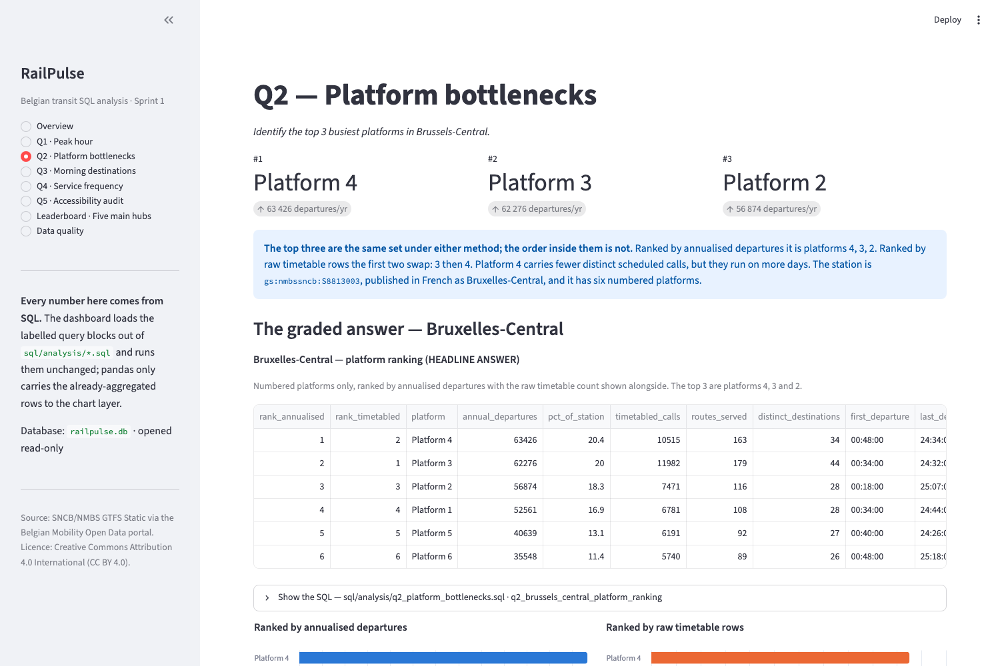
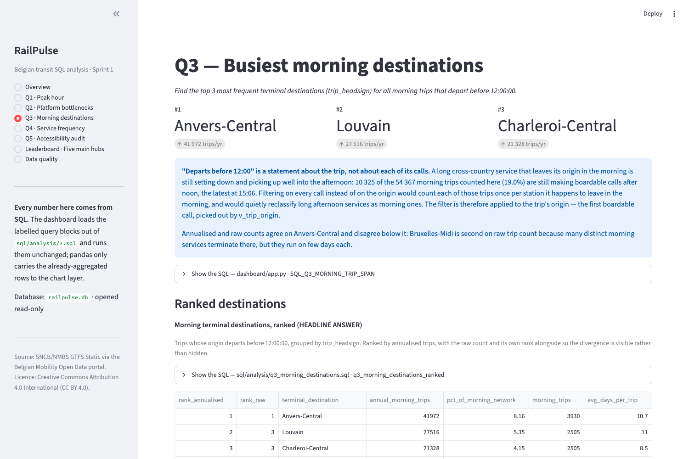
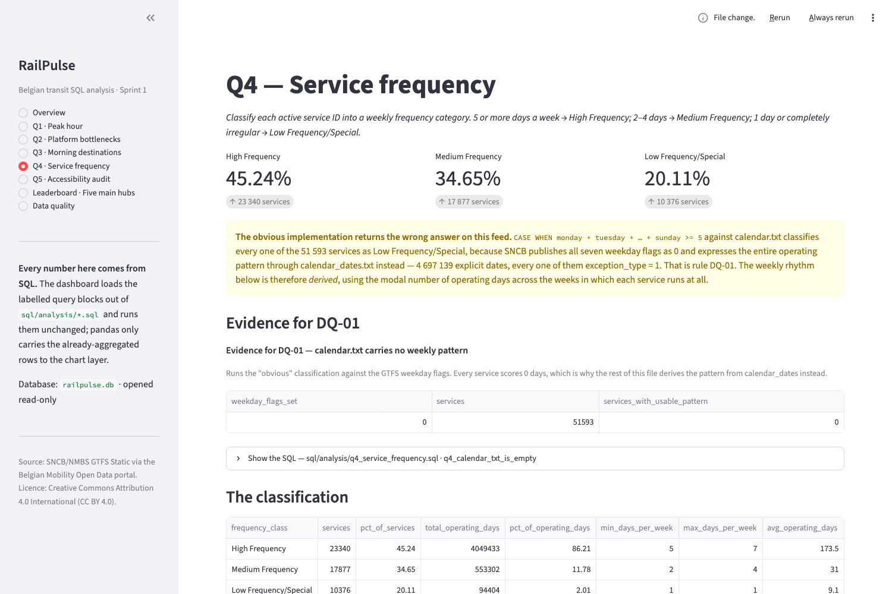
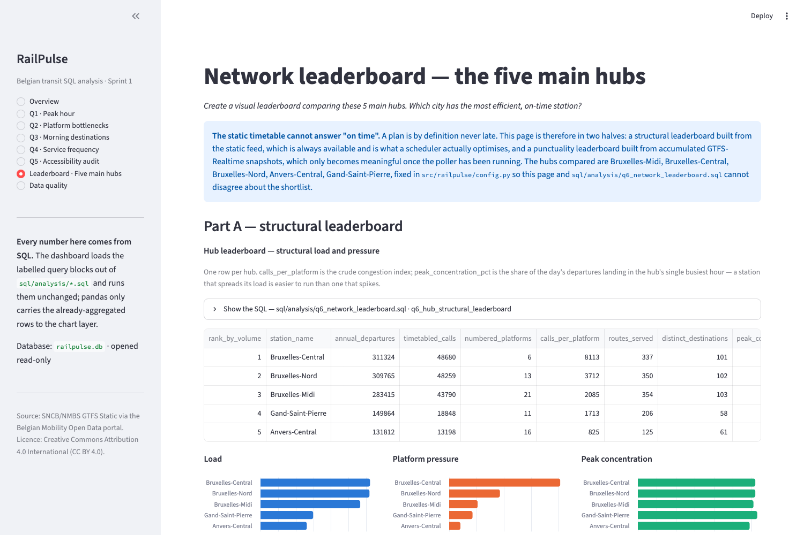
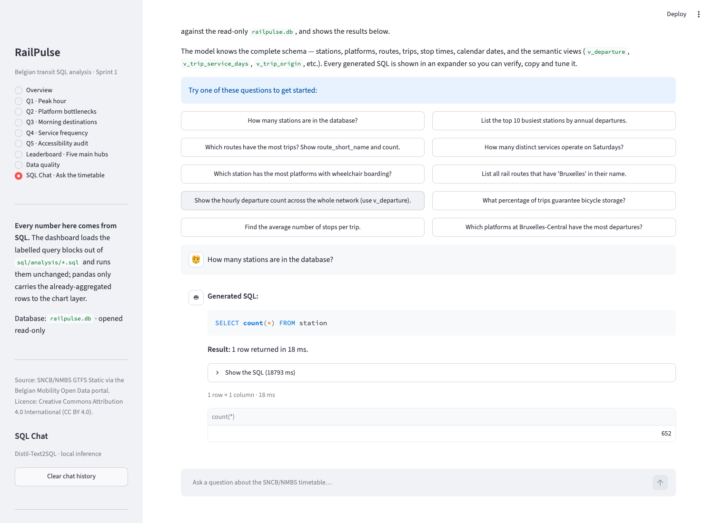

# RailPulse dashboard

The Streamlit report layer over `data/railpulse.db`. Nine sidebar-navigated
pages: an overview, one per graded question, the hub leaderboard, a data
quality page, and an optional natural-language **SQL Chat** page (text-to-SQL).

## What it is, and what it deliberately is not

It is a **renderer**. It contains no analysis.

Every figure on every page is produced by SQL — either a labelled query block
loaded verbatim out of `sql/analysis/qN_*.sql`, or one of the module-level SQL
constants in `app.py`, which exist only where an analysis file could not be
reused (the parameterised station explorer, feed provenance, the KPI header, the
data-quality evidence table). `pandas` appears in exactly one role: carrying
already-aggregated result rows from `sqlite3` to Streamlit and Altair. There is
no `groupby`, no `merge`, no `pivot`, no boolean mask and no `resample` anywhere
in the file, and the constraint is restated as a comment at the import site.

Two consequences worth knowing:

* Every table and chart has a **Show the SQL** expander underneath it with the
  exact statement that produced it. Paste it into `sqlite3` and you get the same
  numbers.
* The dashboard and the graded `.sql` deliverables cannot drift apart, because
  for the five core questions they are the same text. Editing
  `sql/analysis/q1_peak_hour.sql` changes the Q1 page.

The database is opened **read-only** — `railpulse.db.connect(read_only=True)`,
which goes through a `file:...?mode=ro` URI. The dashboard cannot write to the
store even if a hand-edited query tried to.

## Install

From the repository root:

```bash
python -m venv .venv
source .venv/bin/activate          # Windows: .venv\Scripts\activate
pip install -r requirements.txt -r requirements-dashboard.txt
```

`requirements-dashboard.txt` pulls in `streamlit`, `pandas` and `altair` on top
of the pipeline requirements. The ETL pipeline itself never imports any of them.

## Run

**From the repository root**, not from inside `dashboard/`:

```bash
streamlit run dashboard/app.py
```

or, which does the same thing after checking the database is up to date:

```bash
make dashboard
```

It opens on <http://localhost:8501>.

The `railpulse` package lives under `src/`, and `streamlit run` puts
`dashboard/` on `sys.path` rather than the repository root. `app.py` therefore
prepends `<repo>/src` to `sys.path` before its first project import — which is
why the imports in that file are not all at the top and why the order of those
first few lines matters.

## The database has to exist first

The dashboard reads a pre-built SQLite file; it does not build one. If
`data/railpulse.db` is missing, the app says so and stops instead of raising a
stack trace. Build it with:

```bash
make build
# or, without make:
python -m railpulse build
```

The full rebuild downloads the GTFS Static feed from the Belgian Mobility Open
Data portal and takes a few minutes. `RAILPULSE_DB` in `.env` overrides the
location if you keep the database elsewhere.

## Performance and caching

The heaviest queries scan the 1.45 M boardable calls in `v_departure` and join
them to the 134 809 trip calendars. On a warm page cache the slowest single
block on this feed takes a few seconds; on a cold one, with the ~1 GB database
coming off disk for the first time, expect tens of seconds. They run **once**:

* `@st.cache_resource` holds the connection pool, so reruns do not reopen the
  file.
* `@st.cache_data` holds every result set, keyed on the SQL text and its
  parameters, so moving a widget or switching pages replays from cache rather
  than rescanning.

The connection is pooled **per thread**, not shared. `sqlite3` refuses to let a
connection cross threads and `railpulse.db.connect` deliberately does not expose
`check_same_thread` — turning that guard off globally would be the wrong fix.
Streamlit reruns the script on whichever runner thread is free, so a single
cached handle would eventually raise `ProgrammingError`. Caching the pool rather
than the handle keeps connections alive across reruns without ever sharing one.

Expect the first visit to a page to be slow and every subsequent interaction to
be instant. Press `C` in the Streamlit menu (or restart) to clear the cache after
a rebuild.

### One expected warning

Recent Streamlit releases log `use_container_width is deprecated, use
width="stretch"` for every table and chart. That is expected and the app is
correct as written: `requirements-dashboard.txt` pins `streamlit>=1.36,<2`, and
on the older end of that range `st.dataframe` takes `width` as a **pixel count**,
so the new spelling would not warn — it would fail. The deprecated argument works
across the whole pinned range. Switch it when the floor moves past 1.47.

## The pages

| Page | What it shows |
|---|---|
| **Overview** | Feed provenance from `feed_info` and `ingestion_run`, KPI tiles (stations, platforms, routes, trips, timetabled calls, annual departures) and the CC BY 4.0 attribution line. |
| **Q1 · Peak hour** | The annualised-against-naive comparison as a grouped bar chart, the rank-divergence table and chart, and the weekday/weekend split. The two methods disagree, and the disagreement is the finding. |
| **Q2 · Platform bottlenecks** | The graded Bruxelles-Central ranking, plus a station selector that runs the same query against any of the 652 stations, with an hour × platform heatmap. |
| **Q3 · Morning destinations** | Top terminal destinations for trips whose *origin* departs before 12:00, annualised and raw, the morning departure profile, and the destinations in all four published languages. |
| **Q4 · Service frequency** | The three-class breakdown with percentages, the `typical_days_per_week` histogram, the DQ-01 evidence, and a sensitivity table showing how much the split depends on the definition chosen. |
| **Q5 · Accessibility audit** | The mode split, the lowest-scoring routes ranked by passenger exposure, and a prominent caveat that `wheelchair_accessible` is unpopulated for all 134 809 trips. |
| **Leaderboard** | The five main hubs compared structurally, plus the real-time punctuality leaderboard once the poller has collected snapshots. |
| **Data quality** | The nine DQ rules with their counts queried live, the quarantined rows, feed characteristics that change every count, and a live `PRAGMA foreign_key_check`. |
| **SQL Chat** | Ask the timetable in natural language; a local model writes the SQL, which is shown, run read-only under caps, and charted. Optional — see below. |

## SQL Chat — the text-to-SQL page (optional, Sprint-4 preview)

`SQL Chat` lets a non-technical user query the database in English. The question
goes to a locally-running HuggingFace seq2seq model, which returns SQL; that SQL
is shown in an expander, executed against the read-only database, and its result
tabled and auto-charted. It is a fully local preview of Sprint 4's GenAI capstone
— no API key, no cloud call.

**Install (optional, ~2 GB).** The model stack is deliberately *not* part of the
dashboard install, so the report stays lightweight:

```bash
make setup-chat            # or: pip install -e ".[chat]"  /  -r requirements-chat.txt
```

Without it, the page still loads and shows an install prompt instead of crashing.
The default model (`juierror/flan-t5-text2sql-with-schema-v2`, ~0.2 B params)
downloads ~200 MB on first use and runs on CPU.

**Two implementation files.** [`text2sql_engine.py`](text2sql_engine.py) is the
engine — schema extraction, prompt building, the safety guardrail, and the capped
executor; model libraries are imported lazily so the module loads without them.
[`sql_chat_page.py`](sql_chat_page.py) is the Streamlit page.

**Safety — three independent layers** (design rationale in
[`../docs/decisions.md` ADR-14](../docs/decisions.md#adr-14--sql-chat-text-to-sql-is-guarded-by-defence-in-depth-not-by-the-model)):

1. **Read-only connection.** Queries run through `connect(read_only=True)`; a
   write raises at the engine regardless of what SQL was produced.
2. **Whole-statement guardrail** (`_is_safe_sql`). Strips comments, masks string
   literals, rejects stacked statements and any destructive keyword anywhere,
   and requires a leading `SELECT`/`WITH`. It replaced a first-word check that a
   `SELECT 1; DROP TABLE …` passed through.
3. **Execution caps** (`execute_readonly_capped`). A SQLite progress handler
   aborts any query over a wall-clock budget (`TEXT2SQL_TIMEOUT`, default 10 s),
   and rows are `fetchmany`-limited (`TEXT2SQL_MAX_ROWS`, default 5 000). A
   cartesian join or an unbounded `SELECT *` can no longer hang the app.

All three are tested in [`../tests/test_sql_chat.py`](../tests/test_sql_chat.py).

**Honest limitation and how to improve it.** The small default model handles
simple lookups ("how many stations?") and struggles with the multi-table JOINs
the analytical questions need, because a 0.2 B model cannot reliably compose
`v_departure` with `v_trip_service_days` and annualise. The careful schema
guidance in `PROSE_SCHEMA` (row counts, code meanings, "use `v_departure`",
"annualise") is only useful to a model large enough to read it, so it is opt-in:

| Environment variable | Default | Effect |
|---|---|---|
| `TEXT2SQL_MODEL` | `juierror/flan-t5-text2sql-with-schema-v2` | Any HuggingFace seq2seq / text2text model ID |
| `TEXT2SQL_SCHEMA_MODE` | `compact` | `rich` injects the full `PROSE_SCHEMA` + rules into the prompt — use with a capable model |
| `TEXT2SQL_MAX_ROWS` | `5000` | Row ceiling per result |
| `TEXT2SQL_TIMEOUT` | `10` | Per-query wall-clock budget, seconds |

For real answers, point `TEXT2SQL_MODEL` at a larger instruction-tuned model and
set `TEXT2SQL_SCHEMA_MODE=rich`. The default is chosen for a small, fast,
fully-local preview, not for accuracy.

## Charts

Two-series comparisons in this report are always "the naive reading" against
"the corrected reading", so they use **blue and orange** rather than red and
green: the pair survives the common colour-vision deficiencies and a monochrome
print-out. Colour is never the only distinction — the series is named in the
legend and repeated in the table underneath every chart. Heatmaps use a single
blue ramp light-to-dark, because they encode a magnitude.

There are no dual-axis charts. Where two measures have incompatible scales —
950 651 annualised departures against 94 323 timetable rows — they are either
normalised to a shared unit (share of that method's total) or drawn as two
separate charts with the same row ordering, never forced onto one pair of axes.

## Screenshots

Captured from a live run against the built database. All eight pages are in
[`docs/assets/`](../docs/assets/).

### Q1 — the finding the whole report is built on


The blue series (annualised departures) shows the twin commuter peaks of a real
railway; the orange series (naive timetable-row counts) shows a midday plateau
that does not exist. Both are normalised to a share of their own total, because
their absolute scales differ by an order of magnitude.

<details><summary>The other seven pages</summary>

**Overview** — provenance and network scale


**Q2 · Platform bottlenecks** — ranking plus the hour × platform heatmap


**Q3 · Morning destinations**


**Q4 · Service frequency** — classification and the days-per-week histogram


**Q5 · Accessibility audit** — the mode split and the unpopulated-field caveat


**Leaderboard** — the five hubs compared


**Data quality** — the nine DQ rules, counted live


**SQL Chat** — natural-language question → generated SQL → read-only result


</details>

To refresh them, run the app and re-capture; the filenames above are what the
project expects.

## Attribution

Source data: SNCB/NMBS GTFS Static, published on the Belgian Mobility Open Data
portal under the Creative Commons Attribution 4.0 International licence
(CC BY 4.0). The attribution line required by that licence is rendered on the
Overview page and in the sidebar, with the feed version filled in from
`feed_info` so it always names the version actually on screen.
