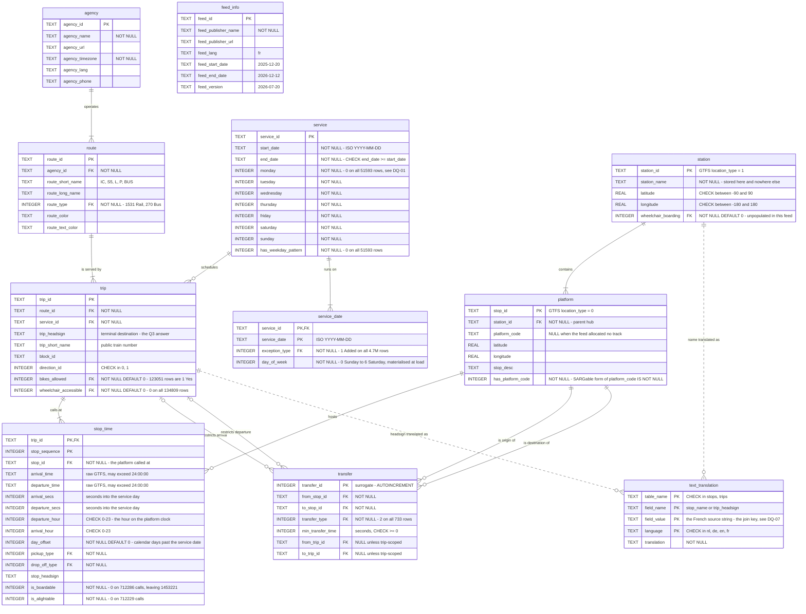
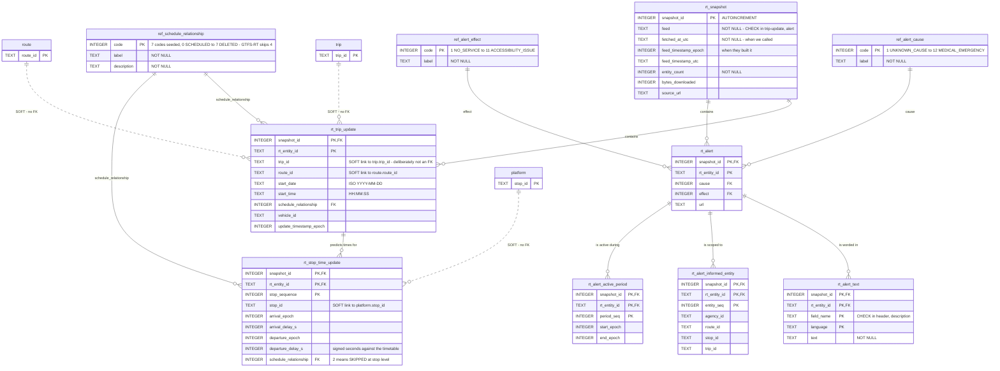

# 🗺️ RailPulse — Entity Relationship Diagram

The physical model as it exists in `data/railpulse.db`. Every column, key and
constraint below was read back from the built database with
`PRAGMA table_info` / `PRAGMA foreign_key_list` rather than transcribed from the
DDL, so it describes what was actually created and not what was intended. It is
still a static file: re-check it against the database after a schema change.

> ⓘ **Unfamiliar with a term used here?** [`glossary.md`](glossary.md) defines every GTFS, database and project-specific word this project uses, with examples from this data.

Source: SNCB/NMBS GTFS Static, feed version `2026-07-20`, timetable window
`2025-12-20` to `2026-12-12` (358 distinct operating dates), `feed_lang = 'fr'`.
`PRAGMA foreign_key_check` returns no rows.

The model is split into three diagrams because one diagram containing all
29 modelled tables is unreadable. They are the same database:

1. **Static core** — the 3NF timetable model, the thing every analytical query
   touches.
2. **Reference and provenance** — the code lookups every core FK points at,
   plus the build's own audit log.
3. **Real-time** — the GTFS-RT landing tables, which attach to the core by a
   deliberately soft link.

Row counts as built:

| Table | Rows | | Table | Rows |
|---|---:|---|---|---:|
| `agency` | 1 | | `stop_time` | 2 165 507 |
| `station` | 652 | | `transfer` | 733 |
| `platform` | 2 243 | | `text_translation` | 2 599 |
| `route` | 1 801 | | `feed_info` | 1 |
| `service` | 51 593 | | `ingestion_run` | 1 |
| `service_date` | 4 697 139 | | `rejected_row` | 12 |
| `trip` | 134 809 | | `rt_*` | accumulating — see §3 |

---

## 1. Static core model

`service_date` and `text_translation` are `WITHOUT ROWID` tables: their primary
key *is* the row, which removes a B-tree hop and stores the key columns once
instead of twice. Measured on the 4.7 M row calendar by loading it both ways
into a scratch database, the `WITHOUT ROWID` form occupies 189 MiB against
354 MiB for a rowid table carrying an equivalent `UNIQUE (service_id,
service_date)` index — a saving of 166 MiB.

`feed_info` has no relationships on purpose. It is a one-row header describing
the whole load, and joining it to anything would be joining a constant.

The two dashed edges into `text_translation` are **not** foreign keys. The feed
ships `record_id` empty on all 2 599 translation rows, so a translation can only
be matched back by its French *value* — `text_translation.field_value` joins to
`station.station_name` or `trip.trip_headsign` as text (DQ-07). A referential
constraint on a non-unique text column is not expressible, and the join is
therefore soft.

### Composite and unique keys not visible above

| Table | Constraint | Why |
|---|---|---|
| `platform` | `UNIQUE (station_id, platform_code)` | A station cannot publish platform "4" twice. Permits one `NULL` code row per station, which is exactly what the feed uses for unallocated tracks. |
| `transfer` | `UNIQUE (from_stop_id, to_stop_id, from_trip_id, to_trip_id)` | The GTFS natural key `(from_stop_id, to_stop_id)` is not unique once the 74 trip-scoped transfers exist, so the surrogate `transfer_id` carries the PK and this tuple carries the uniqueness. |
| `service_date` | `PRIMARY KEY (service_id, service_date)` on a `WITHOUT ROWID` table | One row per calendar day a service runs; the PK is the entire row. |
| `text_translation` | `PRIMARY KEY (table_name, field_name, field_value, language)` on a `WITHOUT ROWID` table | Forced by DQ-07: with no usable `record_id`, the value tuple is the only candidate key. |
| `stop_time` | `PRIMARY KEY (trip_id, stop_sequence)` | The GTFS call identity. A trip may call at the same platform twice, so `(trip_id, stop_id)` would not be unique — 4 761 `(trip_id, stop_id)` pairs occur twice in this feed. |

---

## 2. Reference and provenance tables

Every code column in the core model carries a foreign key into one of these
lookups, so an unrecognised code in a future feed fails at load time instead of
silently skewing an average. Only the columns that participate in the reference
link are shown for the core tables here — see diagram 1 for their full shape.

```mermaid
erDiagram
    ref_accessibility  ||--o{ station      : "wheelchair_boarding"
    ref_accessibility  ||--o{ trip         : "bikes_allowed"
    ref_accessibility  ||--o{ trip         : "wheelchair_accessible"
    ref_route_type     ||--o{ route        : "route_type"
    ref_pickup_drop    ||--o{ stop_time    : "pickup_type"
    ref_pickup_drop    ||--o{ stop_time    : "drop_off_type"
    ref_exception_type ||--o{ service_date : "exception_type"
    ref_transfer_type  ||--o{ transfer     : "transfer_type"
    ingestion_run      ||--o{ rejected_row : "quarantined"

    ref_location_type {
        INTEGER location_type PK "0 Stop/Platform, 1 Station, 2 Entrance/Exit, 3 Generic Node, 4 Boarding Area"
        TEXT label "NOT NULL"
        TEXT description "NOT NULL"
    }

    ref_route_type {
        INTEGER route_type PK "10 GTFS modes seeded"
        TEXT label "NOT NULL"
        TEXT description "NOT NULL"
    }

    ref_pickup_drop {
        INTEGER code PK "0 Regularly scheduled, 1 Not available, 2 Phone agency, 3 Coordinate with driver"
        TEXT label "NOT NULL"
        TEXT description "NOT NULL"
    }

    ref_accessibility {
        INTEGER code PK "0 No information, 1 Yes, 2 No"
        TEXT label "NOT NULL"
        TEXT description "NOT NULL"
        INTEGER is_guaranteed "NOT NULL - 1 only for code 1, the basis of Q5"
    }

    ref_exception_type {
        INTEGER exception_type PK "1 Added, 2 Removed"
        TEXT label "NOT NULL"
        TEXT description "NOT NULL"
    }

    ref_transfer_type {
        INTEGER transfer_type PK "0 Recommended, 1 Timed, 2 Minimum time required, 3 Not possible"
        TEXT label "NOT NULL"
        TEXT description "NOT NULL"
    }

    ingestion_run {
        INTEGER run_id PK "AUTOINCREMENT"
        TEXT started_at_utc "NOT NULL"
        TEXT finished_at_utc
        TEXT source "NOT NULL - gtfs-static, gtfs-rt-trip-update, ..."
        TEXT source_url
        INTEGER http_status
        INTEGER bytes_downloaded
        TEXT source_last_modified "upstream Last-Modified header"
        INTEGER rows_staged
        INTEGER rows_loaded
        INTEGER rows_rejected
        TEXT status "NOT NULL - CHECK in running, ok, failed"
        TEXT notes
    }

    rejected_row {
        INTEGER rejected_id PK "AUTOINCREMENT"
        INTEGER run_id FK "which load threw the row away"
        TEXT source_table "NOT NULL - e.g. stg_stop_times"
        INTEGER src_line_no
        TEXT rule_code "NOT NULL - e.g. DQ-03-IMPLAUSIBLE-DEPARTURE"
        TEXT reason "NOT NULL"
        TEXT payload "JSON snapshot of the offending row"
    }

    station { INTEGER wheelchair_boarding FK "0 on all 652 rows" }
    trip { INTEGER bikes_allowed FK "1 on 123051 of 134809 rows" }
    route { INTEGER route_type FK "2 Rail or 3 Bus" }
    stop_time { INTEGER pickup_type FK "1 Not available on 712286 of 2165507 calls" }
    service_date { INTEGER exception_type FK "1 Added on all 4697139 rows" }
    transfer { INTEGER transfer_type FK "2 on all 733 rows" }
```

`ref_location_type` is seeded with all five GTFS values but is referenced by no
foreign key, and that is the point: splitting `stops.txt` into `station` and
`platform` turned the `location_type` discriminator into two tables, so the
code no longer needs to be stored per row. It is kept because it documents the
source vocabulary the transform decodes.

`rejected_row` currently holds 12 rows, all `DQ-03-IMPLAUSIBLE-DEPARTURE`
(calls scheduled 48 hours or more into their own service day, spanning 2 trips,
at departure times from 63:18:00 to 87:39:00). Nothing else in the feed failed a
constraint.

---

## 3. Real-time model

These tables are created with `IF NOT EXISTS` and survive `railpulse build`,
unlike the static core which is dropped and rebuilt from the feed. A static
timetable can always be re-downloaded; a delay observed at 06:12 cannot.

### Why `rt_trip_update.trip_id` is a soft link and not a foreign key

Every dashed edge in this document marks a join key that is not backed by a
constraint. There are two reasons for that, and they are not the same reason.
The two value-joins into `text_translation` in diagram 1 are soft because DQ-07
leaves nothing unique to constrain — a referential constraint on a non-unique
text column is not expressible. The three dashed edges above are soft by
choice, and the choice needs defending. (`rt_alert_informed_entity` carries
`agency_id`, `route_id`, `stop_id` and `trip_id` on the same terms; they are
left off the diagram only because every alert polled so far scopes itself to
the agency and leaves the other three NULL.)

The static feed is republished by SNCB on its own schedule; the real-time feed
references whatever timetable is live at that instant. In the window between an
upstream publish and our next `railpulse build`, the real-time feed legitimately
names trips our static snapshot has never seen — a newly inserted service, a
re-planned one, a replacement. A hard `REFERENCES trip(trip_id)` would reject
exactly those observations, which are the most operationally interesting rows in
the feed, and `ON DELETE CASCADE` would wipe accumulated delay history every
time the static core is rebuilt.

The link is soft but intended to be *measured*, not soft and ignored:

- `v_rt_departure_performance` `INNER JOIN`s `rt_trip_update` to `trip`, so any
  punctuality query silently and correctly excludes unmatched rows instead of
  reporting delays against a trip it cannot describe.
- The match rate is reported as a post-build check by `railpulse verify`
  (`src/railpulse/verify.py`), which currently returns **100%** — every
  real-time `trip_id` recorded resolves against the static feed. Read that
  number with care: those snapshots were polled within hours of a rebuild,
  which is precisely the case a hard foreign key would also have survived. It
  confirms the join works; it says nothing yet about the drift window this
  design exists to cover. The check is a warning rather than an error, and
  trips below 80% on purpose — a low match rate means the static feed is stale
  and should be rebuilt, not that the pipeline is broken.

Inside the real-time model the constraints are hard: `rt_stop_time_update`,
`rt_alert_text`, `rt_alert_informed_entity` and `rt_alert_active_period` all
carry a composite `FOREIGN KEY (snapshot_id, rt_entity_id) ... ON DELETE
CASCADE`, so deleting a snapshot removes its whole payload atomically.
`rt_snapshot` additionally carries `UNIQUE (feed, feed_timestamp_epoch)`: the
upstream feed refreshes roughly every 30 seconds, and without that guard a
poller running faster than the feed would count the same delay twice.

The `rt_*` tables are no longer empty: `scripts/poll_realtime.sh` has begun
appending snapshots, and every table above except `rt_alert_active_period` holds
rows. No row count is quoted here on purpose — the poller is additive and every
run moves the numbers, so any figure printed in this file would be stale by the
next poll. Read them from the database when you need them.

---

## 4. Relationships in full

`1` denotes exactly one, `0..1` zero or one, `1..N` one or more, `0..N` zero or
more. Counts are from the built database.

### Static core

| Parent | Child | Cardinality | Foreign key column | What it means |
|---|---|---|---|---|
| `agency` | `route` | 1 → 1..N | `route.agency_id` | Every commercial line belongs to one operator. One agency (NMBS/SNCB) owns all 1 801 routes; the column is still a real FK so De Lijn or TEC can be added without a migration. |
| `station` | `platform` | 1 → 1..N | `platform.station_id` | A named hub contains its boarding points. Between 1 and 23 platforms per station, 3.44 on average; Bruxelles-Midi has the most. |
| `route` | `trip` | 1 → 1..N | `trip.route_id` | A line is operated by many individual journeys. 1 to 3 081 trips per route, 74.85 on average; no route is trip-less. |
| `service` | `trip` | 1 → 0..N | `trip.service_id` | A calendar pattern is shared by the journeys that run on those days. 17 288 of the 51 593 services are actually referenced by a trip; the other 34 305 are published in `calendar.txt` but used by nothing in this feed. |
| `service` | `service_date` | 1 → 1..N | `service_date.service_id` | The exploded operating calendar: one row per day the service runs. 1 to 358 dates per service, 91.04 on average. |
| `trip` | `stop_time` | 1 → 1..N | `stop_time.trip_id` | A journey calls at a sequence of platforms. 2 to 69 calls per trip, 16.06 on average. |
| `platform` | `stop_time` | 1 → 0..N | `stop_time.stop_id` | A platform is called at by many trips. Busiest single platform sees 23 391 timetabled calls; 3 of the 2 243 platforms are never called at. |
| `platform` | `transfer` | 1 → 0..N | `transfer.from_stop_id` | Where a connection starts. 664 distinct platforms appear as an origin. |
| `platform` | `transfer` | 1 → 0..N | `transfer.to_stop_id` | Where that connection ends. 725 of the 733 transfers stay inside one station, 659 of them naming the same platform twice — the minimum time to change trains on the same track. |
| `trip` | `transfer` | 0..1 → 0..N | `transfer.from_trip_id` | A connection rule that applies only when arriving on one specific journey. 74 of the 733 transfers are trip-scoped. |
| `trip` | `transfer` | 0..1 → 0..N | `transfer.to_trip_id` | The same, for the departing journey. |
| `station` | `text_translation` | 1 → 0..N | *none — soft, by value* | The nl/de/en name of a hub. 652 nl, 642 de and 642 en station names. Joined on `station_name = field_value`, because DQ-07 leaves `record_id` empty. |
| `trip` | `text_translation` | 1 → 0..N | *none — soft, by value* | The nl/de/en headsign. 221 rows per language. Same value join, same reason. |

### Reference and provenance

| Parent | Child | Cardinality | Foreign key column | What it means |
|---|---|---|---|---|
| `ref_accessibility` | `station` | 1 → 0..N | `station.wheelchair_boarding` | Decodes 0/1/2 into No information / Yes / No. All 652 stations are 0 in this feed. |
| `ref_accessibility` | `trip` | 1 → 0..N | `trip.bikes_allowed` | Whether the journey guarantees bicycle storage. 123 051 trips are 1 (Yes), 11 758 are 0 (No information). |
| `ref_accessibility` | `trip` | 1 → 0..N | `trip.wheelchair_accessible` | Whether the journey guarantees step-free access. 0 on all 134 809 trips — the field is entirely unpopulated, which is itself the Q5 headline. |
| `ref_route_type` | `route` | 1 → 0..N | `route.route_type` | The GTFS mode. 1 531 routes are 2 (Rail), 270 are 3 (rail-replacement Bus). |
| `ref_pickup_drop` | `stop_time` | 1 → 0..N | `stop_time.pickup_type` | Whether boarding is permitted at this call. Code 1 (Not available) on 712 286 of the 2 165 507 calls; `v_departure` drops those and keeps 1 453 221. |
| `ref_pickup_drop` | `stop_time` | 1 → 0..N | `stop_time.drop_off_type` | The same for alighting. Code 1 on 712 229 calls. 577 462 calls are 1 on *both* columns — the true technical pass-throughs, where the train serves the platform but nobody may board or alight. |
| `ref_exception_type` | `service_date` | 1 → 0..N | `service_date.exception_type` | Added or Removed. All 4 697 139 rows are 1 (Added) — the SNCB feed builds its calendar purely additively (DQ-01). |
| `ref_transfer_type` | `transfer` | 1 → 0..N | `transfer.transfer_type` | The connection rule. All 733 rows are 2 (minimum transfer time required). |
| `ingestion_run` | `rejected_row` | 1 → 0..N | `rejected_row.run_id` | Which load quarantined the row. 1 run, 12 rejected rows. |

### Real-time

| Parent | Child | Cardinality | Foreign key column | What it means |
|---|---|---|---|---|
| `rt_snapshot` | `rt_trip_update` | 1 → 0..N | `rt_trip_update.snapshot_id` | One poll of the trip-update feed contains many reported journeys. `ON DELETE CASCADE`. |
| `rt_trip_update` | `rt_stop_time_update` | 1 → 0..N | `(snapshot_id, rt_entity_id)` | The payload: predicted time and signed delay per call. `ON DELETE CASCADE`. |
| `rt_snapshot` | `rt_alert` | 1 → 0..N | `rt_alert.snapshot_id` | One poll of the alert feed contains many disruptions. `ON DELETE CASCADE`. |
| `rt_alert` | `rt_alert_text` | 1 → 0..N | `(snapshot_id, rt_entity_id)` | Header and description, one row per field per language. Modelled as rows rather than `header_fr`/`header_nl`/… columns, which would be a 1NF violation and a migration the day a fifth language appears. |
| `rt_alert` | `rt_alert_informed_entity` | 1 → 0..N | `(snapshot_id, rt_entity_id)` | Which part of the network the alert is about. Every alert polled so far is agency-wide — `agency_id` set, `route_id`/`stop_id`/`trip_id` NULL on every row — but the table models the full GTFS-RT shape. |
| `rt_alert` | `rt_alert_active_period` | 1 → 0..N | `(snapshot_id, rt_entity_id)` | The windows during which the alert applies. |
| `ref_schedule_relationship` | `rt_trip_update` | 1 → 0..N | `schedule_relationship` | SCHEDULED / ADDED / CANCELED and so on at trip level. |
| `ref_schedule_relationship` | `rt_stop_time_update` | 1 → 0..N | `schedule_relationship` | The same enumeration at call level, where 2 means SKIPPED. A skipped call is a cancellation, not a zero-delay departure. |
| `ref_alert_cause` | `rt_alert` | 1 → 0..N | `rt_alert.cause` | STRIKE, WEATHER, TECHNICAL_PROBLEM, … |
| `ref_alert_effect` | `rt_alert` | 1 → 0..N | `rt_alert.effect` | NO_SERVICE, SIGNIFICANT_DELAYS, DETOUR, … |
| `trip` | `rt_trip_update` | 1 → 0..N | `rt_trip_update.trip_id` | **Soft link, no constraint.** See section 3. |
| `route` | `rt_trip_update` | 1 → 0..N | `rt_trip_update.route_id` | **Soft link, no constraint.** |
| `platform` | `rt_stop_time_update` | 1 → 0..N | `rt_stop_time_update.stop_id` | **Soft link, no constraint.** |

---

## 5. Two modelling decisions worth defending

**Why `station` and `platform` are separate tables.** GTFS ships both in one
`stops.txt`, distinguished by a `location_type` column — two different grains in
one file, which is what normalisation exists to prevent. Splitting them buys a
genuine one-to-many key, a natural home for the Q2 "busiest platform" analysis,
and `station_name` stored exactly once. That last point is not theoretical: in
this feed a child stop's `stop_name` is identical to its parent's on all 2 243
rows, so keeping the name on the platform would be a transitive dependency and a
3NF violation. Each station also owns exactly one `platform_code IS NULL` child
(652 of the 2 243 rows), used by the feed for calls where no track has been
allocated — which is why `platform` is unique on `(station_id, platform_code)`
rather than on `platform_code` alone.

**Why `service` keeps seven weekday columns that are all zero.** They are part
of the GTFS contract and a future feed may populate them, so dropping them would
make the model diverge from its source. But every one of the 51 593 services has
all seven flags at 0 and the real calendar lives entirely in
`calendar_dates.txt` (DQ-01), so `has_weekday_pattern` records that the columns
are untrustworthy and Q4 derives weekly frequency from `service_date` instead.
Storing an unreliable column and a flag saying so is better than storing the
column and hoping the next analyst reads the documentation.

---

## 6. Opening this in drawDB

[drawDB](https://www.drawdb.app/) is the visual editor the brief suggests. The
diagram is checked in as [`railpulse.drawdb.json`](./railpulse.drawdb.json),
covering the 19 static and reference tables and all 20 foreign keys of
diagram 1 and 2.

1. Open <https://www.drawdb.app/editor>.
2. **File → Import diagram**, and choose `docs/railpulse.drawdb.json`.
3. The tables land on a prepared grid: reference lookups down the left column,
   `agency`/`route`/`trip`/`transfer` next, the calendar and `stop_time` in the
   middle, `station`/`platform` and the standalone tables on the right, and the
   provenance pair furthest right.
4. **File → Export → PNG** if you want a raster copy. Save it into
   `docs/assets/` so the top-level README can embed it.

Two conventions in that file, so nothing looks wrong on import:

- Each relationship runs **from the child table's foreign key to the parent
  table's primary key**, which is the direction drawDB uses when it generates
  `ALTER TABLE … ADD FOREIGN KEY`. Cardinality is therefore recorded as
  `Many to one`.
- `database` is set to `sqlite`, so drawDB's SQL export matches the dialect the
  project actually uses.

The `.json` file is a convenience for editing, not the source of truth. The
authoritative schema is `sql/02_schema.sql` and `sql/06_realtime.sql`; the
mermaid diagrams above are generated from what those scripts actually produced
in `data/railpulse.db`, and they are what renders on GitHub without a plugin.
