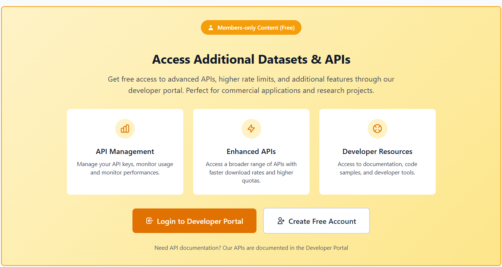
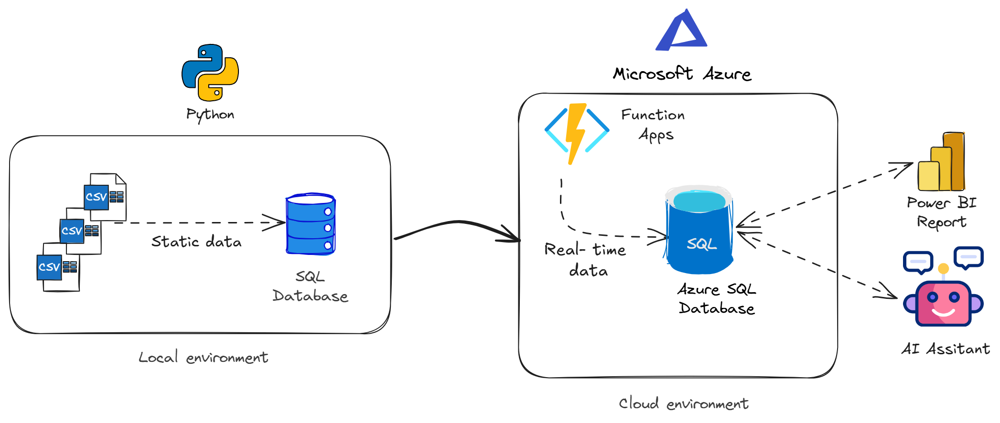

# 🚄 RailwayPulse: End-to-End AI Transit Intelligence Platform

## Mission
Welcome to RailwayPulse, an enterprise-grade transit data engineering and analytics platform. This repository hosts a 4-week production-ready project that builds a modern, hybrid data architecture.

We ingest, clean, and transform both historical schedules (GTFS Static) and live operational streams (GTFS Real-time) from the Belgian National Railway (SNCB/NMBS), De Lijn, and TEC. The entire infrastructure is scaled on the Microsoft Azure Cloud, visualized via Power BI, and exposed through a conversational Generational AI interface.

## Data
 
We will be using data directly from the SNCB developer portal! It includes a:
- Static Data API
- Real-time Data API

Please create an free account for access to the developer portal: [https://data.belgianmobility.io/en/data.html](https://data.belgianmobility.io/en/data.html)

## 🗺️ Project Roadmap & Technical Stack

</img>

### 🚄 Sprint 1: Liveboard Ingestion & Relational SQL Modeling
* **Goal:** Establish the local database infrastructure, handle ingestion of liveboard structures from the iRail API, and implement advanced relational transformations.
* **The Workflow:** 

    1. Create an API key in the SNBC developer portal
    2. Extract the raw static data using the Static Data API.
    3. Execute raw SQL scripts to normalize the data into a production-grade relational schema mapping out the tables.
    4. Write complex SQL CTEs, aggregations, and window functions to audit network delays, platform bottlenecks, and track vehicle punctuality scores across peak hours.
* **🛠️ Tools Used:** Python (`requests`), SQLite or PostgreSQL, DBeaver, Advanced SQL (`JOIN`, `GROUP BY`, `CASE WHEN`, CTEs).

### ⚡ Sprint 2: Cloud Migration & Serverless Ingestion Pipelines 
* **Goal:** Transition infrastructure to the cloud and automate continuous live delay tracking using serverless cloud compute under strict budgetary controls.
* **The Workflow:**
    1. Provision a serverless instance of Azure SQL or Azure Database for PostgreSQL and migrate the Sprint 1 relational schema.
    2. Develop a Python-based **Azure Function** using a **Timer Trigger** configured via a CRON job to execute automatically every 15 to 30 minutes.
    3. The Azure Function polls the `Live trip updates` and `service alerts` for the national railway network every day.
* **🛠️ Tools Used:** Microsoft Azure Portal, Azure SQL, Azure Functions (Python), Environment Variables (Application Settings for secure cloud connection strings).

### 📊 Sprint 3: Enterprise Business Intelligence (Power BI)
* **Goal:** Connect executive BI tools directly to live cloud infrastructure to extract actionable transit patterns and compute network operational metrics.
* **The Workflow:**
    1. Connect Power BI Desktop securely to the live Azure Cloud Database (or local relational replica failback).
    2. Design an optimized semantic data model linking stations, train categories, and historical records.
    3. Write DAX measures to calculate network KPIs, including an overall "On-Time Rate %" metric (thresholding delays under 2 minutes), peak hour volume matrices, and platform congestion distributions.
    4. Build an interactive visual report using drill-down navigation and bookmark features for cross-hub comparisons.
* **🛠️ Tools Used:** Power BI Desktop / Power BI Service, Power Query, DAX.

### 🤖 Sprint 4: Open-Source Conversational Transit Assistant (GenAI Capstone)
* **Goal:** Democratize data access by building a completely free-to-run, natural language Text-to-SQL interface over the live transit database using open-source models.
* **The Workflow:**
    1. Develop a localized Python application utilizing an LLM orchestration framework connected directly to your database.
    2. Engineer robust system prompts and dynamic few-shot templates to safely guide open-source models (such as Llama 3 or Mistral) through your schema constraints without model filler or hallucinations.
    3. Build a secure Text-to-SQL execution engine featuring code-level regex guardrails that intercept and block destructive queries (`DROP`, `DELETE`), allowing non-technical stakeholders to chat directly with liveboards in plain English.
* **🛠️ Tools Used:** Python, Ollama (Local Inference) or Groq API (Free Cloud Inference), LangChain / OpenAI Client Wrapper, Streamlit.